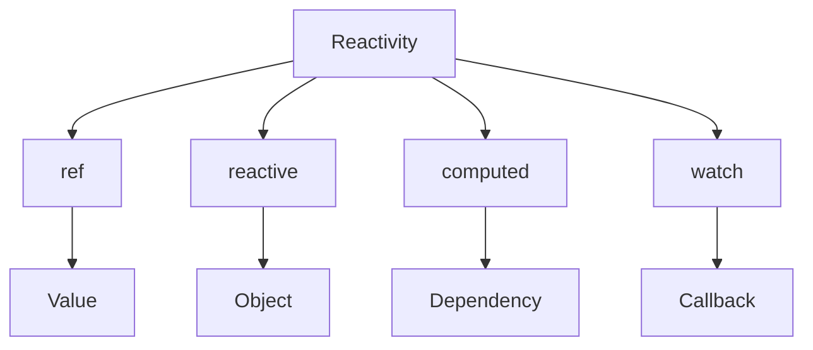

# Реактивність: ref, reactive, computed, watch

## Вступ

Реактивність — це серце Vue 3. Вона дозволяє автоматично оновлювати UI при зміні даних. Основні інструменти: ref, reactive, computed, watch.

## ref

### Основи

-   Створює реактивне значення для простих типів
-   Доступ до значення через `.value`

#### Приклад

```js
import { ref } from "vue";
const count = ref(0);
count.value++;
```

### Неочевидний приклад: ref для DOM

```js
const inputRef = ref(null);
// <input ref="inputRef">
```

## reactive

### Основи

-   Створює реактивний об'єкт або масив
-   Всі властивості стають реактивними

#### Приклад

```js
import { reactive } from "vue";
const state = reactive({ user: { name: "Ivan" }, items: [1, 2, 3] });
state.user.name = "Petro";
state.items.push(4);
```

### Неочевидний приклад: глибока реактивність

```js
const deep = reactive({ a: { b: { c: 1 } } });
deep.a.b.c = 2; // UI оновиться
```

## computed

### Основи

-   Створює реактивне значення, яке залежить від інших
-   Автоматично оновлюється при зміні залежностей

#### Приклад

```js
import { ref, computed } from "vue";
const count = ref(2);
const double = computed(() => count.value * 2);
```

### Неочевидний приклад: computed з getter/setter

```js
const name = ref("Ivan");
const upper = computed({
    get: () => name.value.toUpperCase(),
    set: (v) => {
        name.value = v.toLowerCase();
    },
});
```

## watch

### Основи

-   Відстежує зміни реактивних даних
-   Викликає callback при зміні

#### Приклад

```js
import { ref, watch } from "vue";
const count = ref(0);
watch(count, (newVal, oldVal) => {
    console.log("count changed:", oldVal, "->", newVal);
});
```

### Неочевидний приклад: watch для об'єкта

```js
const state = reactive({ x: 1 });
watch(
    () => state.x,
    (val) => {
        console.log("x changed:", val);
    }
);
```

## Пояснення під капотом

-   ref — обгортка над значенням, Proxy
-   reactive — Proxy для об'єкта
-   computed — dependency tracking, кешування
-   watch — dependency graph, callback

## Підводні камені

-   Не можна робити реактивними Map, Set
-   computed кешується, але може не оновитись при неправильних залежностях
-   watch може викликатись зайво
-   ref для об'єкта — не глибока реактивність

## Best practices

-   Використовуйте ref для простих типів
-   reactive — для складних структур
-   computed — для складних обчислень
-   watch — для побічних ефектів
-   Документуйте складну реактивну логіку
-   Тестуйте реактивність компонентів

## Діаграми



## Неочевидні приклади

### 1. computed для масиву

```js
const arr = ref([1, 2, 3]);
const sum = computed(() => arr.value.reduce((a, b) => a + b, 0));
```

### 2. watch з immediate

```js
watch(
    count,
    (val) => {
        console.log("init:", val);
    },
    { immediate: true }
);
```

### 3. ref для функції

```js
const fn = ref(() => 42);
console.log(fn.value());
```

## Крос-посилання

-   [Ядро Vue 3: реактивність, рендеринг](./02-core-reactivity-rendering.md)
-   [Компоненти, реактивність](./02-components-reactivity.md)
-   [TypeScript: реактивність](../TypeScript/08-frameworks.md)

## Підсумок

-   ref — для простих типів
-   reactive — для об'єктів
-   computed — для складних обчислень
-   watch — для побічних ефектів
-   Best practices — тестування, документація, правильний вибір інструменту
-   Підводні камені — неглибока реактивність, кешування, зайві виклики
