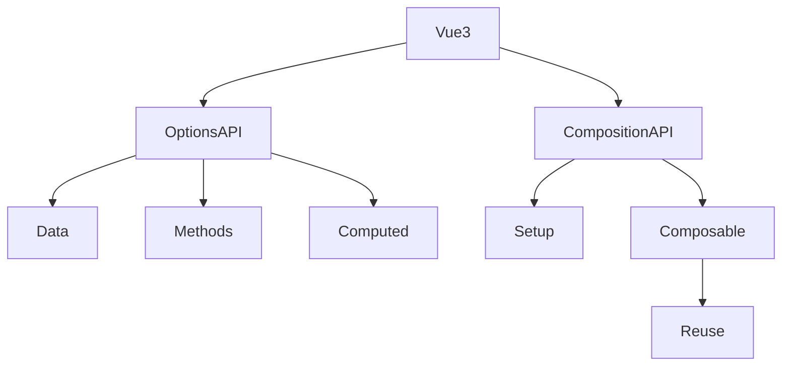

# Composition API vs Options API

## Вступ

Vue 3 підтримує два підходи до створення компонентів: Options API (традиційний) та Composition API (новий, гнучкий). Вибір між ними впливає на архітектуру, масштабованість та підтримку коду.

## Options API

### Основи

-   Опис компоненту через об'єкт: data, methods, computed, watch
-   Простий для невеликих компонентів
-   Зрозуміла структура

#### Приклад

```js
export default {
    data() {
        return { count: 0 };
    },
    methods: {
        inc() {
            this.count++;
        },
    },
    computed: {
        double() {
            return this.count * 2;
        },
    },
};
```

### Неочевидний приклад: mixins

```js
const mixin = {
    data() {
        return { x: 1 };
    },
};
export default {
    mixins: [mixin],
    data() {
        return { y: 2 };
    },
};
```

## Composition API

### Основи

-   Опис компоненту через функцію setup
-   Використання ref, reactive, computed, watch
-   Гнучкість, повторне використання логіки

#### Приклад

```js
import { ref, computed } from "vue";
export default {
    setup() {
        const count = ref(0);
        const double = computed(() => count.value * 2);
        function inc() {
            count.value++;
        }
        return { count, double, inc };
    },
};
```

### Неочевидний приклад: custom composable

```js
// useCounter.js
import { ref } from "vue";
export function useCounter() {
    const count = ref(0);
    function inc() {
        count.value++;
    }
    return { count, inc };
}
// component
import { useCounter } from "./useCounter";
export default {
    setup() {
        const { count, inc } = useCounter();
        return { count, inc };
    },
};
```

## Пояснення під капотом

-   Options API — об'єкт, this, автоматичне зв'язування
-   Composition API — функція, scope, явне управління залежностями
-   Composition API дозволяє створювати composable-функції для повторного використання

## Підводні камені

-   Options API — складно масштабувати, mixins можуть конфліктувати
-   Composition API — складніше для новачків, можливі проблеми з читабельністю
-   Можливі помилки при змішуванні API

## Best practices

-   Для простих компонентів — Options API
-   Для складної логіки, великих проєктів — Composition API
-   Використовуйте composable-функції для повторного використання
-   Документуйте логіку у setup
-   Не змішуйте Options та Composition API у одному компоненті

## Діаграми



## Неочевидні приклади

### 1. Передача props у setup

```js
export default {
    props: ["msg"],
    setup(props) {
        console.log(props.msg);
        return { msg: props.msg };
    },
};
```

### 2. Використання watch у Composition API

```js
import { ref, watch } from "vue";
export default {
    setup() {
        const count = ref(0);
        watch(count, (val) => {
            console.log("count changed:", val);
        });
        return { count };
    },
};
```

### 3. Composable для fetch

```js
import { ref } from "vue";
export function useFetch(url) {
    const data = ref(null);
    fetch(url)
        .then((r) => r.json())
        .then((j) => (data.value = j));
    return { data };
}
```

## Крос-посилання

-   [Реактивність: ref, reactive, computed, watch](./03-reactivity.md)
-   [Ядро Vue 3: реактивність, рендеринг](./02-core-reactivity-rendering.md)
-   [TypeScript: інтеграція з фреймворками](../TypeScript/08-frameworks.md)

## Підсумок

-   Options API — простота, зрозуміла структура
-   Composition API — гнучкість, повторне використання логіки
-   Best practices — composable-функції, документація, не змішувати API
-   Підводні камені — складність, конфлікти, читабельність
