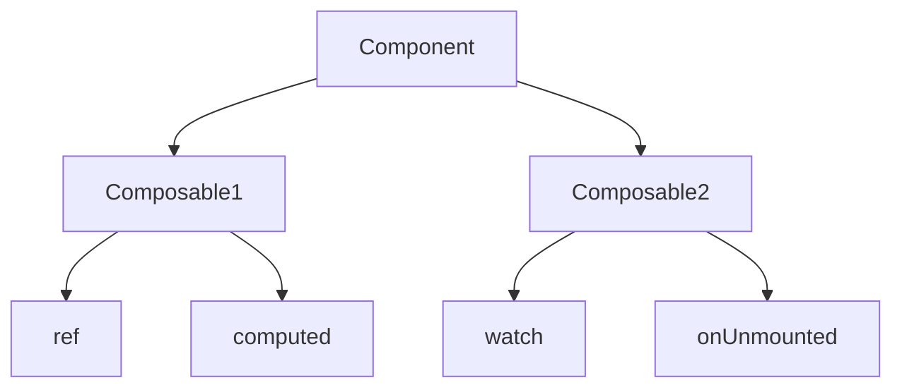

# Composables — реюзабельна логіка

## Вступ

Composables — це функції, які дозволяють повторно використовувати реактивну логіку у Vue 3. Вони є основою Composition API та забезпечують чисту, масштабовану архітектуру.

## Основи composables

-   Composable — це звичайна JS/TS-функція, яка повертає реактивні змінні, функції, computed, watch
-   Використовується у setup компоненту
-   Дозволяє розділяти логіку між компонентами

#### Приклад: простий composable

```js
// useCounter.js
import { ref } from "vue";
export function useCounter() {
    const count = ref(0);
    function inc() {
        count.value++;
    }
    return { count, inc };
}
// component
import { useCounter } from "./useCounter";
export default {
    setup() {
        const { count, inc } = useCounter();
        return { count, inc };
    },
};
```

## Неочевидний приклад: composable з watch

```js
import { ref, watch } from "vue";
export function useTimer() {
    const time = ref(Date.now());
    setInterval(() => {
        time.value = Date.now();
    }, 1000);
    watch(time, (val) => {
        console.log("Time updated:", val);
    });
    return { time };
}
```

## Пояснення під капотом

-   Composable — це функція, яка створює реактивний scope
-   Всі реактивні змінні, створені у composable, ізольовані для кожного виклику
-   Можна комбінувати composables для складної логіки

## Підводні камені

-   Composables можуть створювати memory leaks, якщо не очищати ресурси (setInterval, event listeners)
-   Складна логіка — важко дебажити
-   Можливі конфлікти імен
-   Неочевидна робота з lifecycle

## Best practices

-   Використовуйте composables для повторної логіки (fetch, auth, form)
-   Документуйте API composable-функцій
-   Очищайте ресурси через onUnmounted
-   Використовуйте TypeScript для типізації
-   Тестуйте composables окремо

## Діаграми



## Неочевидні приклади

### 1. Composable для fetch з очищенням

```js
import { ref, onUnmounted } from "vue";
export function useFetch(url) {
    const data = ref(null);
    let active = true;
    fetch(url)
        .then((r) => r.json())
        .then((j) => {
            if (active) data.value = j;
        });
    onUnmounted(() => {
        active = false;
    });
    return { data };
}
```

### 2. Composable для форми

```js
import { ref } from "vue";
export function useForm() {
    const name = ref("");
    const email = ref("");
    function submit() {
        /* ... */
    }
    return { name, email, submit };
}
```

### 3. Composable для авторизації

```js
import { ref } from "vue";
export function useAuth() {
    const user = ref(null);
    function login(u) {
        user.value = u;
    }
    function logout() {
        user.value = null;
    }
    return { user, login, logout };
}
```

## Крос-посилання

-   [Composition API vs Options API](./04-composition-vs-options.md)
-   [Реактивність: ref, reactive, computed, watch](./03-reactivity.md)
-   [TypeScript: інтеграція з фреймворками](../TypeScript/08-frameworks.md)

## Підсумок

-   Composables — основа реюзабельної логіки у Vue 3
-   Best practices — очищення ресурсів, типізація, тестування, документація
-   Підводні камені — memory leaks, складна логіка, lifecycle
-   Неочевидні приклади — fetch, форми, авторизація
