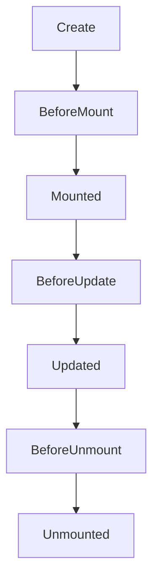

# Життєвий цикл компоненту

## Вступ

Життєвий цикл компоненту у Vue — це послідовність етапів, які проходить компонент від створення до знищення. Розуміння lifecycle — ключ до керування ресурсами, побічними ефектами та оптимізації.

## Основні етапи життєвого циклу

-   Створення (creation)
-   Монтування (mounting)
-   Оновлення (updating)
-   Знищення (unmounting)

### Діаграма життєвого циклу



## Lifecycle hooks у Options API

-   `beforeCreate` — ініціалізація даних
-   `created` — доступ до data, methods
-   `beforeMount` — до рендеру
-   `mounted` — DOM доступний
-   `beforeUpdate` — перед оновленням
-   `updated` — після оновлення
-   `beforeUnmount` — перед знищенням
-   `unmounted` — після знищення

#### Приклад

```js
export default {
    data() {
        return { x: 1 };
    },
    mounted() {
        console.log("Mounted!");
    },
    beforeUnmount() {
        console.log("Before unmount!");
    },
};
```

## Lifecycle hooks у Composition API

-   Використовуються функції: `onMounted`, `onUnmounted`, `onUpdated`, `onBeforeMount`, `onBeforeUpdate`, `onBeforeUnmount`

#### Приклад

```js
import { onMounted, onUnmounted } from "vue";
export default {
    setup() {
        onMounted(() => {
            console.log("Mounted!");
        });
        onUnmounted(() => {
            console.log("Unmounted!");
        });
    },
};
```

### Неочевидний приклад: очищення ресурсів

```js
import { ref, onUnmounted } from "vue";
export default {
    setup() {
        const timer = setInterval(() => {}, 1000);
        onUnmounted(() => {
            clearInterval(timer);
        });
    },
};
```

## Пояснення під капотом

-   Lifecycle hooks — це точки входу у процеси компонента
-   Vue автоматично викликає hooks у потрібний момент
-   Hooks дозволяють керувати ресурсами, підписками, побічними ефектами

## Підводні камені

-   Забуте очищення ресурсів — memory leaks
-   Виклик асинхронних операцій у неправильному hook
-   Конфлікти при змішуванні Options та Composition API
-   Неочевидна робота з nested компонентами

## Best practices

-   Очищайте ресурси у onUnmounted
-   Використовуйте onMounted для ініціалізації
-   Не змішуйте API у одному компоненті
-   Документуйте складну логіку у hooks
-   Тестуйте поведінку компонентів при оновленні та знищенні

## Неочевидні приклади

### 1. Асинхронна ініціалізація у onMounted

```js
import { ref, onMounted } from "vue";
export default {
    setup() {
        const data = ref(null);
        onMounted(async () => {
            data.value = await fetch("/api/data").then((r) => r.json());
        });
        return { data };
    },
};
```

### 2. Очищення підписок

```js
import { onUnmounted } from "vue";
export default {
    setup() {
        const unsubscribe = subscribeToStore();
        onUnmounted(() => {
            unsubscribe();
        });
    },
};
```

### 3. Відстеження оновлень

```js
import { onUpdated } from "vue";
export default {
    setup() {
        onUpdated(() => {
            console.log("Component updated!");
        });
    },
};
```

## Крос-посилання

-   [Composables — реюзабельна логіка](./05-composables.md)
-   [Composition API vs Options API](./04-composition-vs-options.md)
-   [TypeScript: інтеграція з фреймворками](../TypeScript/08-frameworks.md)

## Підсумок

-   Життєвий цикл — створення, монтування, оновлення, знищення
-   Lifecycle hooks — точки керування ресурсами та ефектами
-   Best practices — очищення, документація, тестування
-   Підводні камені — memory leaks, конфлікти, асинхронність
