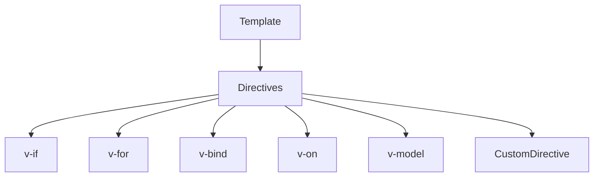

# Робота з шаблонами: синтаксис, директиви

## Вступ

Шаблони у Vue — це декларативний спосіб опису UI. Директиви — спеціальні атрибути для керування поведінкою елементів у шаблоні. Володіння цими механізмами — ключ до ефективної роботи з Vue.

## Синтаксис шаблонів

-   Використовується HTML-подібний синтаксис
-   Доступ до реактивних змінних через подвійні фігурні дужки: `{{ value }}`
-   Події, умови, цикли — через директиви

#### Приклад

```html
<template>
    <div>
        <h1>{{ title }}</h1>
        <button @click="inc">{{ count }}</button>
    </div>
</template>
<script setup>
    import { ref } from "vue";
    const title = ref("Hello");
    const count = ref(0);
    function inc() {
        count.value++;
    }
</script>
```

## Директиви

### Основні директиви

#### `v-if`, `v-else`, `v-else-if` — умовний рендеринг

-   Відображає/ховає елемент залежно від умови
-   Елемент не існує у DOM, якщо умова хибна
-   Можна комбінувати з `v-else` та `v-else-if` для складної логіки

```html
<div v-if="isAdmin">Адмін</div>
<div v-else-if="isUser">Користувач</div>
<div v-else>Гість</div>
```

-   **Підводний камінь**: часті зміни — краще використовувати `v-show`

#### `v-for` — цикли

-   Рендерить елемент для кожного елемента масиву/об'єкта
-   Потрібен унікальний `key` для оптимізації

```html
<li v-for="item in items" :key="item.id">{{ item.name }}</li>
```

-   Можна отримати індекс: `v-for="(item, idx) in items"`
-   **Підводний камінь**: дублювання ключів — баги при оновленні

#### `v-bind` — прив'язка атрибутів

-   Динамічно прив'язує значення до атрибуту елемента
-   Скорочення: `:`

```html

```

-   Можна передати об'єкт: `<input v-bind="{ type: 'text', value: name }" />`
-   **Підводний камінь**: неправильний тип даних — некоректна робота

#### `v-on` — обробка подій

-   Прив'язує обробник до події елемента
-   Скорочення: `@`

```html
<button @click="inc">+</button>
```

-   Можна передати аргументи: `<button @click="doSomething(item)">`
-   **Підводний камінь**: забуті обробники — memory leaks

#### `v-model` — двостороння прив'язка

-   Синхронізує значення між UI та даними
-   Працює з input, select, textarea, кастомними компонентами

```html
<input v-model="name" />
```

-   Для кастомних компонентів потрібен event `update:modelValue`
-   **Підводний камінь**: неочікувані ефекти при складних структурах

#### `v-show` — видимість

-   Відображає/ховає елемент через CSS (`display: none`)
-   Елемент завжди присутній у DOM

```html
<div v-show="isVisible">Видимий</div>
```

-   Краще для частих змін видимості
-   **Підводний камінь**: елемент у DOM навіть якщо не видно — впливає на продуктивність

#### Приклад: v-if, v-for

```html
<template>
    <div v-if="isVisible">Visible!</div>
    <ul>
        <li v-for="item in items" :key="item.id">{{ item.name }}</li>
    </ul>
</template>
<script setup>
    import { ref } from "vue";
    const isVisible = ref(true);
    const items = ref([
        { id: 1, name: "A" },
        { id: 2, name: "B" },
    ]);
</script>
```

### Неочевидний приклад: v-bind з об'єктом

```html
<template>
    <input v-bind="{ type: 'text', value: name, placeholder: 'Enter name' }" />
</template>
<script setup>
    import { ref } from "vue";
    const name = ref("");
</script>
```

### Неочевидний приклад: кастомна директива

```js
// v-focus.js
export default {
  mounted(el) { el.focus(); }
};
// component
<template>
  <input v-focus>
</template>
<script>
import vFocus from './v-focus';
export default {
  directives: { focus: vFocus }
};
</script>
```

## Пояснення під капотом

-   Директиви — це функції, які змінюють поведінку елементів
-   Vue парсить шаблон, створює Virtual DOM
-   Директиви працюють через hooks: created, mounted, updated, unmounted

## Підводні камені

-   v-if vs v-show — різна продуктивність
-   v-for — потрібен унікальний key
-   Кастомні директиви — складна логіка, важко дебажити
-   v-model — може створювати неочікувані ефекти

## Best practices

-   Використовуйте v-if для умовного рендерингу, v-show — для частих змін видимості
-   Завжди додавайте key у v-for
-   Документуйте кастомні директиви
-   Уникайте складної логіки у шаблоні
-   Тестуйте поведінку директив

## Діаграми



## Неочевидні приклади

### 1. v-for з індексом

```html
<li v-for="(item, idx) in items" :key="idx">{{ item }}</li>
```

### 2. v-model з кастомним компонентом

```html
<MyInput v-model="value" />
```

### 3. Кастомна директива для форматування

```js
export default {
    mounted(el) {
        el.style.textTransform = "uppercase";
    },
};
```

## Крос-посилання

-   [Життєвий цикл компоненту](./06-lifecycle.md)
-   [Composables — реюзабельна логіка](./05-composables.md)
-   [TypeScript: інтеграція з фреймворками](../TypeScript/08-frameworks.md)

## Підсумок

-   Шаблони — декларативний опис UI
-   Директиви — керування поведінкою елементів
-   Best practices — key у v-for, документація, тестування
-   Підводні камені — v-if/v-show, кастомні директиви, v-model
