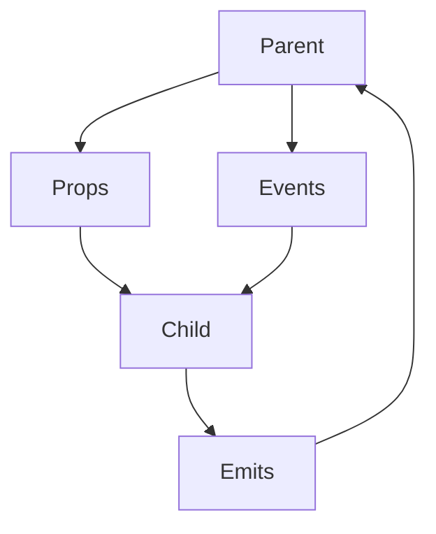

# Props, emits, events

## Вступ

Props, emits та events — це фундаментальні механізми для взаємодії між компонентами у Vue. Вони забезпечують передачу даних, реакцію на дії користувача та побудову гнучкої архітектури.

## Props

### Основи

-   Props — це властивості, які передаються від батьківського до дочірнього компоненту
-   Дозволяють налаштовувати компонент
-   Можна типізувати, задати значення за замовчуванням, зробити обов'язковими

#### Приклад

```js
// Parent.vue
<MyButton label="OK" />
// MyButton.vue
<script setup>
defineProps({ label: String });
</script>
```

### Неочевидний приклад: props з валідацією

```js
<script setup>
defineProps({
  age: {
    type: Number,
    required: true,
    validator: v => v > 0
  }
});
</script>
```

## Emits

### Основи

-   Emits — це події, які компонент може генерувати для батьківського
-   Оголошуються через defineEmits
-   Використовуються для передачі дій наверх

#### Приклад

```js
<script setup>
const emit = defineEmits(['update']);
function updateValue(val) {
  emit('update', val);
}
</script>
```

### Неочевидний приклад: типізація emits

```js
<script setup lang="ts">
const emit = defineEmits<{ (e: 'save', data: string): void }>();
function save(data: string) {
  emit('save', data);
}
</script>
```

## Events

### Основи

-   Events — це механізм взаємодії між компонентами через emits
-   Батьківський компонент слухає події дочірнього

#### Приклад

```html
<MyButton @update="onUpdate" />
```

### Неочевидний приклад: кастомна подія

```js
// Child.vue
<script setup>
const emit = defineEmits(['custom']);
function fire() { emit('custom', { x: 1 }); }
</script>
// Parent.vue
<MyButton @custom="handleCustom" />
```

## Пояснення під капотом

-   Props — це аргументи компоненту, реактивні
-   Emits — це механізм для передачі дій наверх
-   Events — це зв'язок між компонентами через прослуховування подій
-   Vue автоматично зв'язує props та events через Virtual DOM

## Підводні камені

-   Неправильна типізація props/emits — runtime errors
-   Відсутність валідації props — баги
-   Забуті події — не працює зв'язок
-   Змішування props та events — складна логіка

## Best practices

-   Типізуйте props та emits
-   Використовуйте валідацію для props
-   Документуйте API компонентів
-   Уникайте надмірної кількості props
-   Тестуйте передачу подій

## Діаграми



## Неочевидні приклади

### 1. Props з default

```js
<script setup>
defineProps({
  color: { type: String, default: 'blue' }
});
</script>
```

### 2. Emits з кількома подіями

```js
<script setup>
const emit = defineEmits(['save', 'cancel']);
function save() { emit('save'); }
function cancel() { emit('cancel'); }
</script>
```

### 3. Передача функції через props

```js
// Parent.vue
<MyButton :onClick="doSomething" />
// MyButton.vue
<script setup>
defineProps({ onClick: Function });
</script>
```

## Крос-посилання

-   [Робота з шаблонами: директиви](./07-templates-directives.md)
-   [Composables — реюзабельна логіка](./05-composables.md)
-   [TypeScript: інтеграція з фреймворками](../TypeScript/08-frameworks.md)

## Підсумок

-   Props — для передачі даних
-   Emits — для передачі дій
-   Events — для зв'язку між компонентами
-   Best practices — типізація, валідація, документація, тестування
-   Підводні камені — runtime errors, забуті події, складна логіка
