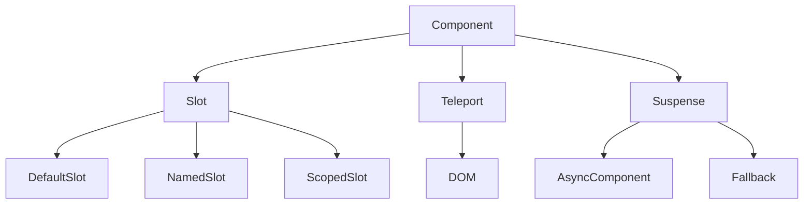

# Слоти, Teleport, Suspense

## Вступ

Слоти, Teleport та Suspense — це потужні механізми Vue 3 для гнучкого управління контентом, рендерингом та асинхронністю. Вони дозволяють створювати складні UI-патерни з мінімальними зусиллями.

## Слоти

### Основи

-   Слоти — це місця для вставки довільного контенту у компонент
-   Дозволяють створювати гнучкі, реюзабельні компоненти
-   Підтримуються default, named, scoped слоти

#### Приклад: default slot

```html
<MyCard>
    <h1>Заголовок</h1>
    <p>Контент</p>
</MyCard>
```

#### Приклад: named slot

```html
<MyCard>
    <template #header>Заголовок</template>
    <template #footer>Футер</template>
</MyCard>
```

#### Приклад: scoped slot

```html
<MyList v-slot="{ item }">
    <li>{{ item.name }}</li>
</MyList>
```

### Неочевидний приклад: динамічний slot

```html
<MyModal>
    <template v-if="show" #content>Динамічний контент</template>
</MyModal>
```

## Teleport

### Основи

-   Teleport — це механізм для рендерингу елемента у довільне місце DOM
-   Використовується для модалок, тултіпів, попапів

#### Приклад

```html
<Teleport to="#modal">
    <div>Модалка</div>
</Teleport>
```

### Неочевидний приклад: Teleport у body

```html
<Teleport to="body">
    <div>Глобальний попап</div>
</Teleport>
```

## Suspense

### Основи

-   Suspense — це компонент для асинхронного рендерингу
-   Дозволяє показувати fallback, поки асинхронний контент не готовий

#### Приклад

```html
<Suspense>
    <template #default>
        <AsyncComponent />
    </template>
    <template #fallback>
        <div>Завантаження...</div>
    </template>
</Suspense>
```

### Неочевидний приклад: Suspense з кількома async компонентами

```html
<Suspense>
    <template #default>
        <AsyncA />
        <AsyncB />
    </template>
    <template #fallback>
        <div>Loading...</div>
    </template>
</Suspense>
```

## Пояснення під капотом

-   Слоти — це механізм передачі контенту через Virtual DOM
-   Teleport — змінює місце рендерингу елемента
-   Suspense — управляє асинхронним рендерингом, показує fallback

## Підводні камені

-   Слоти — складна логіка, важко дебажити
-   Teleport — можливі конфлікти стилів, подій
-   Suspense — не всі async компоненти підтримують
-   Некоректне використання fallback — поганий UX

## Best practices

-   Документуйте API слотів
-   Використовуйте Teleport для модалок, попапів
-   Тестуйте поведінку Suspense з різними async компонентами
-   Уникайте надмірної вкладеності слотів
-   Перевіряйте коректність селектора у Teleport

## Діаграми



## Неочевидні приклади

### 1. Scoped slot з функцією

```html
<MyTable v-slot="{ row, index }">
    <tr>
        <td>{{ index }}</td>
        <td>{{ row.name }}</td>
    </tr>
</MyTable>
```

### 2. Teleport для тултіпа

```html
<Teleport to="#tooltip">
    <div class="tooltip">Підказка</div>
</Teleport>
```

### 3. Suspense з асинхронним fetch

```js
<script setup>
import { defineAsyncComponent } from 'vue';
const AsyncData = defineAsyncComponent(() => fetch('/api/data').then(r => r.json()));
</script>
<Suspense>
  <template #default>
    <AsyncData />
  </template>
  <template #fallback>
    <div>Loading...</div>
  </template>
</Suspense>
```

## Крос-посилання

-   [Props, emits, events](./08-props-emits-events.md)
-   [Робота з шаблонами: директиви](./07-templates-directives.md)
-   [TypeScript: інтеграція з фреймворками](../TypeScript/08-frameworks.md)

## Підсумок

-   Слоти — для гнучкого контенту
-   Teleport — для рендерингу поза компонентом
-   Suspense — для асинхронного рендерингу
-   Best practices — документація, тестування, коректність селекторів
-   Підводні камені — складна логіка, конфлікти стилів, fallback
