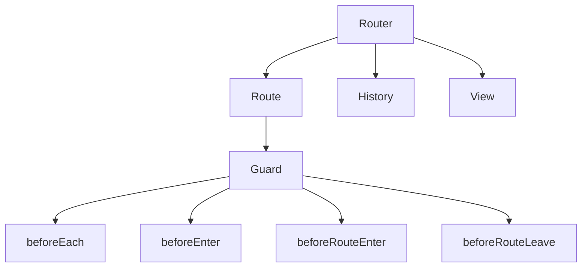

# Роутінг: Vue Router, guards

## Вступ

Vue Router — це офіційний роутер для Vue.js, який дозволяє створювати SPA з навігацією, захистом маршрутів та асинхронним завантаженням компонентів.

## Основи Vue Router

-   Дозволяє визначати маршрути, компоненти для кожного маршруту
-   Підтримує вкладені маршрути, динамічні параметри, lazy loading
-   Навігація через `<router-link>`, `<router-view>`

#### Приклад: базова конфігурація

```js
import { createRouter, createWebHistory } from "vue-router";
const routes = [
    { path: "/", component: Home },
    { path: "/about", component: About },
];
const router = createRouter({
    history: createWebHistory(),
    routes,
});
export default router;
```

#### Приклад: використання у компоненті

```html
<template>
    <router-link to="/about">About</router-link>
    <router-view />
</template>
```

## Guards (захист маршрутів)

### Основи

-   Guards — це функції, які виконуються перед/після переходу між маршрутами
-   Використовуються для авторизації, логування, валідації

### Види guards

-   `beforeEach` — глобальний guard
-   `beforeEnter` — guard для окремого маршруту
-   `beforeRouteEnter`, `beforeRouteUpdate`, `beforeRouteLeave` — guards у компоненті

#### Приклад: глобальний guard

```js
router.beforeEach((to, from, next) => {
    if (to.meta.requiresAuth && !isAuthenticated()) {
        next("/login");
    } else {
        next();
    }
});
```

#### Приклад: guard у компоненті

```js
export default {
    beforeRouteLeave(to, from, next) {
        if (hasUnsavedChanges()) {
            if (confirm("Ви впевнені?")) next();
            else next(false);
        } else {
            next();
        }
    },
};
```

### Неочевидний приклад: асинхронний guard

```js
router.beforeEach(async (to, from, next) => {
    const ok = await checkPermission(to);
    if (ok) next();
    else next("/denied");
});
```

## Пояснення під капотом

-   Vue Router створює history-об'єкт, слухає зміни URL
-   Guards — це middleware для контролю переходів
-   Guards можуть бути асинхронними, зупиняти чи перенаправляти навігацію

## Підводні камені

-   Забуті guards — відкриті маршрути
-   Асинхронні guards — затримки навігації
-   Некоректна робота з вкладеними маршрутами
-   Конфлікти при використанні декількох guards

## Best practices

-   Використовуйте guards для авторизації, валідації
-   Документуйте логіку guards
-   Тестуйте навігацію та захист маршрутів
-   Уникайте складної логіки у guards
-   Lazy loading для оптимізації

## Діаграми



## Неочевидні приклади

### 1. Динамічний параметр маршруту

```js
const routes = [{ path: "/user/:id", component: User }];
```

### 2. Lazy loading компоненту

```js
const routes = [{ path: "/about", component: () => import("./About.vue") }];
```

### 3. Guard для вкладеного маршруту

```js
const routes = [
    {
        path: "/admin",
        component: Admin,
        beforeEnter: (to, from, next) => {
            if (!isAdmin()) next("/");
            else next();
        },
    },
];
```

## Крос-посилання

-   [Слоти, Teleport, Suspense](./09-slots-teleport-suspense.md)
-   [Props, emits, events](./08-props-emits-events.md)
-   [TypeScript: інтеграція з фреймворками](../TypeScript/08-frameworks.md)

## Підсумок

-   Vue Router — навігація, SPA, history
-   Guards — захист маршрутів, middleware
-   Best practices — авторизація, lazy loading, документація
-   Підводні камені — забуті guards, асинхронність, конфлікти
