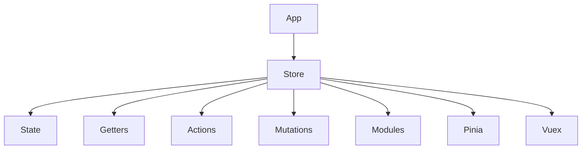

# State management: Pinia, Vuex

## Вступ

State management — це централізоване управління станом додатку. У Vue 3 основні інструменти — Pinia (новий стандарт) та Vuex (legacy). Вони дозволяють зберігати, змінювати та синхронізувати дані між компонентами.

## Pinia

### Основи

-   Pinia — офіційний state manager для Vue 3
-   Простий API, підтримка TypeScript, модульність
-   Store — це об'єкт з state, getters, actions

#### Приклад: створення store

```js
// stores/counter.js
import { defineStore } from "pinia";
export const useCounter = defineStore("counter", {
    state: () => ({ count: 0 }),
    getters: {
        double: (state) => state.count * 2,
    },
    actions: {
        inc() {
            this.count++;
        },
    },
});
```

#### Використання у компоненті

```js
<script setup>
import { useCounter } from './stores/counter';
const counter = useCounter();
</script>
<template>
  <button @click="counter.inc">{{ counter.count }}</button>
</template>
```

### Неочевидний приклад: асинхронна action

```js
actions: {
  async fetchData() {
    const data = await fetch('/api/data').then(r => r.json());
    this.data = data;
  }
}
```

## Vuex

### Основи

-   Vuex — state manager для Vue 2/3 (legacy)
-   Store — state, mutations, actions, getters
-   Мутування state лише через mutations

#### Приклад: базовий store

```js
import { createStore } from "vuex";
const store = createStore({
    state: { count: 0 },
    mutations: {
        inc(state) {
            state.count++;
        },
    },
    actions: {
        incAsync({ commit }) {
            setTimeout(() => commit("inc"), 1000);
        },
    },
    getters: {
        double: (state) => state.count * 2,
    },
});
```

#### Використання у компоненті

```js
<script setup>
import { useStore } from 'vuex';
const store = useStore();
</script>
<template>
  <button @click="store.commit('inc')">{{ store.state.count }}</button>
</template>
```

### Неочевидний приклад: modules

```js
const store = createStore({
    modules: {
        user: {
            state: () => ({ name: "Ivan" }),
            mutations: {
                setName(state, n) {
                    state.name = n;
                },
            },
        },
    },
});
```

## Пояснення під капотом

-   Pinia — реактивний store, actions можуть бути асинхронними
-   Vuex — state, mutations, actions, getters, модульна структура
-   Store — singleton, доступний у всіх компонентах

## Підводні камені

-   Pinia — неправильне використання actions/getters — баги
-   Vuex — складна структура, boilerplate
-   Можливі race conditions при асинхронних діях
-   Некоректна робота з SSR

## Best practices

-   Використовуйте Pinia для нових проєктів
-   Розбивайте store на модулі
-   Документуйте структуру state
-   Тестуйте actions та mutations
-   Уникайте складної логіки у store

## Діаграми



## Неочевидні приклади

### 1. Pinia з computed

```js
const counter = useCounter();
const triple = computed(() => counter.count * 3);
```

### 2. Vuex з асинхронною action

```js
actions: {
  async fetchUser({ commit }) {
    const user = await fetch('/api/user').then(r => r.json());
    commit('setUser', user);
  }
}
```

### 3. SSR з Pinia

```js
import { createPinia } from "pinia";
const pinia = createPinia();
app.use(pinia);
```

## Крос-посилання

-   [Роутінг: Vue Router, guards](./10-router-guards.md)
-   [Composables — реюзабельна логіка](./05-composables.md)
-   [TypeScript: інтеграція з фреймворками](../TypeScript/08-frameworks.md)

## Підсумок

-   State management — централізований стан
-   Pinia — сучасний, простий, реактивний
-   Vuex — legacy, складний, boilerplate
-   Best practices — модулі, тестування, документація
-   Підводні камені — складна логіка, race conditions, SSR
