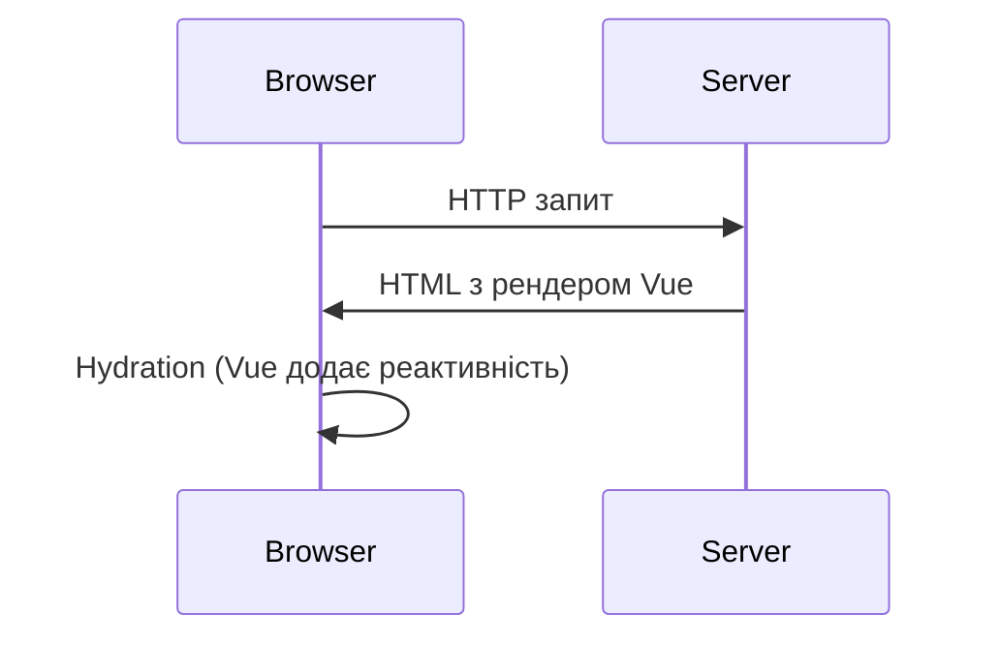
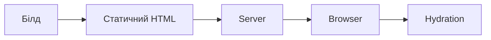
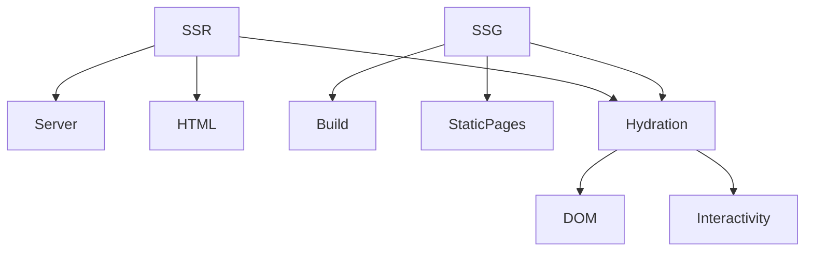

# SSR, SSG, Hydration

## Глибоке пояснення теми

### Що таке SSR, SSG, Hydration?

-   **SSR (Server-Side Rendering)** — це рендеринг додатку на сервері, результатом якого є готовий HTML, який надсилається клієнту. Клієнт отримує вже згенеровану сторінку, що прискорює перший рендер і покращує SEO.
-   **SSG (Static Site Generation)** — це генерація HTML-сторінок на етапі білду. Всі сторінки створюються заздалегідь, і сервер лише віддає статичні файли. Це ідеально для блогів, документації, лендингів.
-   **Hydration** — це "оживлення" статичного HTML на клієнті. Після SSR/SSG Vue додає реактивність, event listeners, і сторінка стає інтерактивною.

### Як працює SSR?

-   Сервер отримує запит, рендерить компонент Vue у HTML.
-   HTML надсилається браузеру.
-   На клієнті запускається Vue, виконується hydration — DOM стає інтерактивним.
-   SSR дозволяє відображати динамічний контент до завантаження JS.

#### Архітектура SSR



### Як працює SSG?

-   Під час білду всі сторінки рендеряться у HTML.
-   Сервер віддає статичні файли.
-   Клієнт отримує HTML, потім виконується hydration.
-   SSG не підходить для динамічного контенту, але ідеальний для SEO та швидкості.

#### Архітектура SSG



### Як працює Hydration?

-   Коли браузер отримує HTML, Vue "оживляє" DOM, додає реактивність, event listeners.
-   Якщо HTML не співпадає з очікуваним — Vue показує warning.
-   Hydration дозволяє поєднати швидкість SSR/SSG з інтерактивністю SPA.

### Порівняння SSR vs SSG vs SPA

| Підхід | SEO | Швидкість | Динаміка | Складність |
| ------ | --- | --------- | -------- | ---------- |
| SSR    | +++ | ++        | ++       | +++        |
| SSG    | +++ | +++       | +        | ++         |
| SPA    | +   | +         | +++      | +          |

### Коли обирати SSR, SSG, Hydration?

-   **SSR** — коли потрібен динамічний контент, SEO, швидкий перший рендер (інтернет-магазини, новини).
-   **SSG** — для статичних сайтів, блогів, документації.
-   **Hydration** — завжди після SSR/SSG для інтерактивності.

### Підводні камені та практичні поради

-   SSR складний у налаштуванні, потребує синхронізації state між сервером і клієнтом.
-   SSG не підходить для часто змінюваного контенту.
-   Hydration може давати warnings, якщо state не співпадає.
-   Для SEO потрібно налаштовувати мета-теги, OpenGraph, sitemap.
-   Тестуйте hydration на різних сторінках, особливо з асинхронними даними.
-   Використовуйте Nuxt для SSR/SSG — він автоматизує більшість процесів.

### Advanced: Partial Hydration, Islands Architecture

-   Partial Hydration — "оживлення" лише частини сторінки для оптимізації.
-   Islands Architecture — рендеринг окремих "островів" інтерактивності, решта — статичний HTML.

### Додаткові ресурси

-   [Nuxt Docs: SSR, SSG](https://nuxt.com/docs/getting-started/rendering-modes)
-   [Vue SSR Guide](https://vuejs.org/guide/scaling-up/ssr.html)
-   [VitePress SSG](https://vitepress.dev/guide/deploy)

---

## Вступ

SSR (Server-Side Rendering), SSG (Static Site Generation) та Hydration — це сучасні підходи до рендерингу у Vue 3, які забезпечують швидкість, SEO та інтерактивність додатків.

## SSR (Server-Side Rendering)

### Основи

-   Рендеринг компонентів на сервері, HTML повертається клієнту
-   Покращує SEO, швидкість першого рендеру
-   Використовується у Nuxt, Vite SSR

#### Приклад SSR

```js
// server.js
import { createSSRApp } from "vue";
import App from "./App.vue";
const app = createSSRApp(App);
// ...рендеринг через серверний фреймворк
```

### Неочевидний приклад: SSR з Pinia

```js
import { createSSRApp } from "vue";
import { createPinia } from "pinia";
const app = createSSRApp(App);
app.use(createPinia());
```

## SSG (Static Site Generation)

### Основи

-   Генерація HTML-файлів на етапі білду
-   Всі сторінки статичні, швидке завантаження
-   Використовується у Nuxt, VitePress

#### Приклад SSG

```js
// nuxt.config.js
export default {
    target: "static",
};
```

### Неочевидний приклад: SSG для блогу

-   Контент генерується з markdown-файлів
-   Всі сторінки доступні без серверу

## Hydration

### Основи

-   Процес "оживлення" статичного HTML на клієнті
-   Додає інтерактивність після SSR/SSG
-   Vue порівнює DOM та додає event listeners

#### Приклад

```html
<!-- HTML з SSR -->
<div id="app">{{ message }}</div>
<script src="/bundle.js"></script>
```

### Неочевидний приклад: hydration з помилкою

-   Якщо HTML не співпадає з клієнтським рендером — warning
-   Важливо синхронізувати state між сервером і клієнтом

## Пояснення під капотом

-   SSR — рендеринг на сервері, передача HTML
-   SSG — білд статичних сторінок
-   Hydration — "оживлення" DOM, додавання реактивності
-   Vue автоматично визначає, коли потрібна hydration

## Підводні камені

-   SSR — складна настройка, проблеми з state
-   SSG — обмеження на динамічний контент
-   Hydration — можливі розбіжності DOM
-   SEO — потрібно налаштовувати мета-теги

## Best practices

-   Використовуйте SSR для SEO та швидкого рендеру
-   SSG — для блогів, документації, статичних сайтів
-   Синхронізуйте state між сервером і клієнтом
-   Тестуйте hydration на різних сторінках
-   Документуйте налаштування SSR/SSG

## Діаграми



## Неочевидні приклади

### 1. SSR з асинхронними даними

```js
// server.js
const data = await fetchData();
const app = createSSRApp({
    data() {
        return { data };
    },
});
```

### 2. SSG з markdown

```js
// vitepress
export default {
    markdown: {
        /* ... */
    },
};
```

### 3. Hydration з Pinia

```js
import { createSSRApp } from "vue";
import { createPinia } from "pinia";
const app = createSSRApp(App);
app.use(createPinia());
```

## Крос-посилання

-   [State management: Pinia, Vuex](./11-state-management.md)
-   [Роутінг: Vue Router, guards](./10-router-guards.md)
-   [TypeScript: інтеграція з фреймворками](../TypeScript/08-frameworks.md)

## Підсумок

-   SSR — серверний рендеринг, SEO, швидкість
-   SSG — статичні сторінки, швидке завантаження
-   Hydration — інтерактивність після SSR/SSG
-   Best practices — синхронізація state, тестування, документація
-   Підводні камені — складна настройка, розбіжності DOM, SEO
