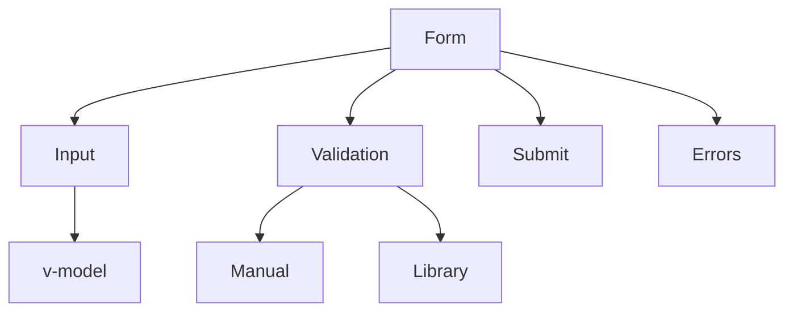

# Робота з формами та валідація

## Вступ

Форми та валідація — ключові механізми для взаємодії користувача з додатком. У Vue 3 вони реалізуються через реактивність, директиви, кастомні компоненти та сторонні бібліотеки.

## Механізми роботи з формами

-   Використання v-model для двосторонньої прив'язки
-   Реактивні змінні для state форми
-   Обробка подій: submit, input, change
-   Валідація даних: ручна, через бібліотеки

### Приклад: базова форма

```html
<template>
    <form @submit.prevent="submit">
        <input v-model="name" placeholder="Ім'я" />
        <input v-model.number="age" type="number" placeholder="Вік" />
        <button type="submit">Відправити</button>
    </form>
</template>
<script setup>
    import { ref } from "vue";
    const name = ref("");
    const age = ref(0);
    function submit() {
        alert(`Ім'я: ${name.value}, Вік: ${age.value}`);
    }
</script>
```

### Неочевидний приклад: кастомний компонент з v-model

```html
<MyInput v-model="email" />
```

## Валідація

### Основи

-   Ручна перевірка у методах
-   Валідація через computed
-   Використання бібліотек: Vuelidate, vee-validate

#### Приклад: ручна валідація

```js
const errors = ref([]);
function validate() {
    errors.value = [];
    if (!name.value) errors.value.push("Ім’я обов’язкове");
    if (age.value < 18) errors.value.push("Вік >= 18");
}
```

#### Приклад: валідація через computed

```js
const isValid = computed(() => name.value && age.value >= 18);
```

### Неочевидний приклад: асинхронна валідація

```js
async function validateEmail(email) {
    const exists = await checkEmail(email);
    return !exists;
}
```

## Сторонні бібліотеки

-   Vuelidate — декларативна валідація
-   vee-validate — schema-based, інтеграція з Yup

#### Приклад: vee-validate

```js
import { useForm, useField } from "vee-validate";
import * as yup from "yup";
const { handleSubmit } = useForm({
    validationSchema: yup.object({
        name: yup.string().required(),
        age: yup.number().min(18),
    }),
});
const { value: name } = useField("name");
const { value: age } = useField("age");
```

## Архітектура форм у Vue

-   Реактивний state для кожного поля
-   Валідація через computed, methods або бібліотеки
-   Відображення помилок у UI
-   Submit через @submit.prevent
-   Кастомні компоненти для input, select, checkbox

## Діаграми



## Best practices

-   Використовуйте v-model для простоти
-   Валідуйте дані до submit
-   Відображайте помилки у UI
-   Використовуйте бібліотеки для складних форм
-   Тестуйте edge cases (порожні, невалідні дані)
-   Документуйте структуру форми

## Підводні камені

-   Некоректна робота v-model з кастомними компонентами
-   Валідація лише на клієнті — ризик безпеки
-   Асинхронна валідація — затримки
-   Відсутність відображення помилок

## Advanced: динамічні форми, масиви полів

-   Динамічне створення полів через v-for
-   Масиви input, валідація кожного елемента

### Приклад: динамічна форма

```html
<template>
    <div v-for="(item, idx) in items" :key="idx">
        <input v-model="item.value" />
    </div>
</template>
<script setup>
    import { ref } from "vue";
    const items = ref([{ value: "" }, { value: "" }]);
</script>
```

## Коли обирати бібліотеку?

-   Для складних форм, багатьох полів, асинхронної валідації — vee-validate, Vuelidate
-   Для простих — ручна валідація

## Додаткові ресурси

-   [Vuelidate Docs](https://vuelidate-next.netlify.app/)
-   [vee-validate Docs](https://vee-validate.logaretm.com/v4/)
-   [Vue Forms Guide](https://vuejs.org/guide/forms.html)

## Крос-посилання

-   [Робота з шаблонами: директиви](./07-templates-directives.md)
-   [State management: Pinia, Vuex](./11-state-management.md)
-   [TypeScript: інтеграція з фреймворками](../TypeScript/08-frameworks.md)

## Підсумок

-   Форми — v-model, реактивність, кастомні компоненти
-   Валідація — ручна, computed, бібліотеки
-   Best practices — тестування, відображення помилок, документація
-   Підводні камені — некоректна робота, асинхронність, безпека
