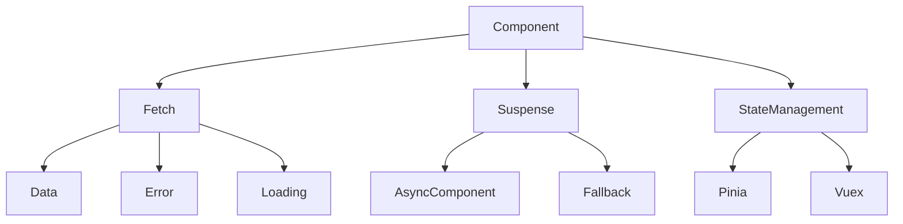
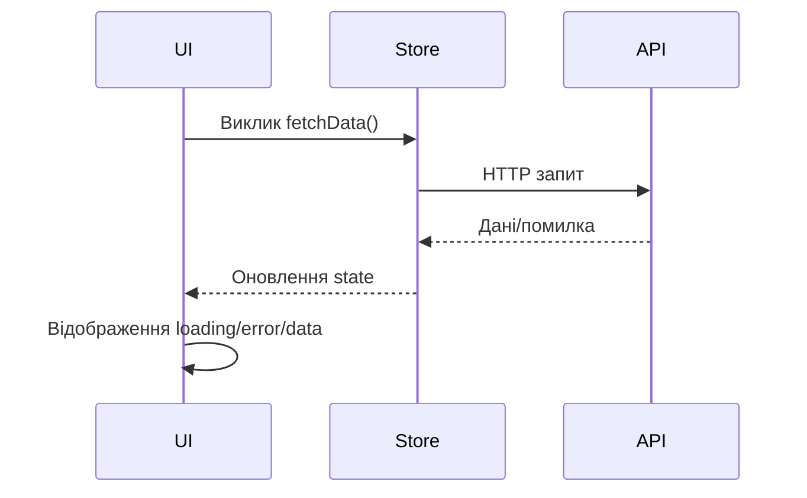

# Робота з асинхронними даними

## Вступ

Асинхронні дані — це основа сучасних веб-додатків. У Vue 3 робота з асинхронністю реалізується через fetch, axios, async/await, Suspense, composables та state management.

## Механізми роботи з асинхронними даними

-   Використання fetch, axios для запитів
-   async/await для зручної роботи з промісами
-   Suspense для асинхронного рендерингу
-   State management (Pinia, Vuex) для зберігання даних
-   Обробка помилок, loading state

### Приклад: базовий fetch

```js
<script setup>
import { ref, onMounted } from 'vue';
const data = ref(null);
const loading = ref(true);
const error = ref(null);
onMounted(async () => {
  try {
    const res = await fetch('/api/data');
    data.value = await res.json();
  } catch (e) {
    error.value = e;
  } finally {
    loading.value = false;
  }
});
</script>
```

### Неочевидний приклад: axios з composable

```js
// useApi.js
import { ref } from "vue";
import axios from "axios";
export function useApi(url) {
    const data = ref(null);
    const loading = ref(false);
    const error = ref(null);
    async function fetchData() {
        loading.value = true;
        try {
            const res = await axios.get(url);
            data.value = res.data;
        } catch (e) {
            error.value = e;
        } finally {
            loading.value = false;
        }
    }
    return { data, loading, error, fetchData };
}
```

## Suspense

-   Suspense дозволяє рендерити fallback, поки асинхронний компонент не готовий
-   Підтримка асинхронних компонентів через defineAsyncComponent

#### Приклад

```html
<Suspense>
    <template #default>
        <AsyncComponent />
    </template>
    <template #fallback>
        <div>Завантаження...</div>
    </template>
</Suspense>
```

## State management для асинхронних даних

-   Зберігання даних у Pinia/Vuex
-   Actions для асинхронних запитів
-   Відображення loading/error у UI

#### Приклад: Pinia з async action

```js
import { defineStore } from "pinia";
export const useDataStore = defineStore("data", {
    state: () => ({ data: null, loading: false, error: null }),
    actions: {
        async fetchData() {
            this.loading = true;
            try {
                const res = await fetch("/api/data");
                this.data = await res.json();
            } catch (e) {
                this.error = e;
            } finally {
                this.loading = false;
            }
        },
    },
});
```

## Архітектура асинхронних даних у Vue

-   Запит даних у onMounted/setup
-   Зберігання у state management
-   Відображення loading/error
-   Suspense для асинхронного рендерингу
-   Composables для реюзабельної логіки

## Діаграми



## Глибоке пояснення теми

### Як працює асинхронність у Vue?

-   Запит даних зазвичай виконується у lifecycle-хуках (`onMounted`, `setup`).
-   Дані зберігаються у реактивних змінних або централізованому state (Pinia/Vuex).
-   Loading/error state дозволяє керувати UX.
-   Suspense дозволяє рендерити fallback, поки дані не готові.
-   Composables — для реюзабельної логіки fetch, кешування, обробки помилок.

### Архітектура асинхронних даних



### Advanced патерни

-   **Кешування**: зберігайте дані у Map/Pinia, щоб уникати повторних запитів.
-   **AbortController**: скасовуйте запити при переході між сторінками.
-   **Polling**: періодичне оновлення даних через setInterval.
-   **Debounce/Throttle**: оптимізація запитів при input.
-   **Optimistic UI**: оновлення UI до завершення запиту.

#### Приклад: AbortController

```js
const controller = new AbortController();
fetch(url, { signal: controller.signal });
// ...
controller.abort();
```

### Порівняння підходів

| Підхід      | Плюси              | Мінуси                   |
| ----------- | ------------------ | ------------------------ |
| fetch/axios | Простота, контроль | Обробка помилок вручну   |
| Composables | Реюзабельність     | Складність логіки        |
| Pinia/Vuex  | Централізація, кеш | Boilerplate              |
| Suspense    | UX, fallback       | Потрібен async компонент |

### Підводні камені та практичні поради

-   Race conditions: кілька запитів — використовуйте AbortController.
-   Некоректна обробка помилок — завжди показуйте error state.
-   Loading state: скидайте при завершенні запиту.
-   Кешування: уникайте дублювання запитів.
-   Тестуйте edge cases: повільний інтернет, помилки API.

### Коли використовувати Suspense?

-   Для асинхронних компонентів, які залежать від fetch.
-   Для складних UI з багатьма async частинами.
-   Для покращення UX при завантаженні.

### Додаткові ресурси

-   [Vue Suspense Guide](https://vuejs.org/guide/built-ins/suspense.html)
-   [Pinia Docs](https://pinia.vuejs.org/)
-   [Axios Docs](https://axios-http.com/)

---

## Best practices

-   Використовуйте async/await для читабельності
-   Відображайте loading/error у UI
-   Використовуйте Suspense для асинхронних компонентів
-   Зберігайте дані у state management
-   Тестуйте обробку помилок
-   Документуйте API запитів

## Підводні камені

-   Некоректна обробка помилок — поганий UX
-   Loading state не скидається — зависання
-   Асинхронні компоненти — затримки рендеру
-   Race conditions при кількох запитах

## Advanced: кешування, повторні запити

-   Кешування даних у composable/store
-   Повторні запити при помилці
-   AbortController для скасування запитів

### Приклад: кешування

```js
const cache = new Map();
async function fetchWithCache(url) {
    if (cache.has(url)) return cache.get(url);
    const res = await fetch(url);
    const data = await res.json();
    cache.set(url, data);
    return data;
}
```

## Коли використовувати Suspense?

-   Для асинхронних компонентів, які залежать від fetch
-   Для складних UI з багатьма async частинами

## Додаткові ресурси

-   [Vue Suspense Guide](https://vuejs.org/guide/built-ins/suspense.html)
-   [Pinia Docs](https://pinia.vuejs.org/)
-   [Axios Docs](https://axios-http.com/)

## Крос-посилання

-   [State management: Pinia, Vuex](./11-state-management.md)
-   [SSR, SSG, Hydration](./12-ssr-ssg-hydration.md)
-   [TypeScript: інтеграція з фреймворками](../TypeScript/08-frameworks.md)

## Підсумок

-   Асинхронні дані — fetch, axios, Suspense, state management
-   Best practices — loading/error, кешування, тестування
-   Підводні камені — помилки, race conditions, затримки
