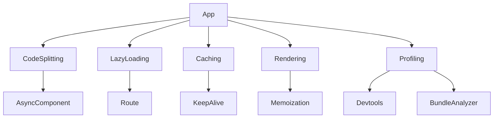

# Performance: оптимізація, code splitting

## Вступ

Оптимізація продуктивності — ключ до швидких, масштабованих Vue-додатків. Вона охоплює code splitting, кешування, lazy loading, оптимізацію рендерингу, профілювання та використання сучасних інструментів.

## Основні механізми оптимізації

-   Code splitting — розділення коду на частини для швидкого завантаження
-   Lazy loading компонентів та маршрутів
-   Кешування даних та компонентів
-   Оптимізація рендерингу (v-show vs v-if, memoization)
-   Використання Suspense для асинхронних компонентів
-   Профілювання та аналіз bundle size

### Приклад: code splitting для компоненту

```js
const AsyncComponent = defineAsyncComponent(() => import("./BigComponent.vue"));
```

### Приклад: lazy loading маршруту

```js
const routes = [{ path: "/about", component: () => import("./About.vue") }];
```

### Неочевидний приклад: кешування компоненту

```html
<KeepAlive>
    <MyComponent />
</KeepAlive>
```

## Advanced: оптимізація рендерингу

-   Використовуйте v-show для частих змін видимості, v-if — для рідких
-   Memoization через computed для складних обчислень
-   Відстеження змін через watchEffect
-   Винесення важких компонентів у окремі чанки

#### Приклад: memoization

```js
const expensive = computed(() => heavyCalculation(data.value));
```

## Профілювання та аналіз

-   Використовуйте Devtools для аналізу рендерингу
-   Аналізуйте bundle size через tools (Webpack Bundle Analyzer, Vite Visualizer)
-   Виявляйте bottlenecks у рендерингу

## Діаграми



## Best practices

-   Використовуйте code splitting для великих компонентів
-   Lazy loading для маршрутів та компонентів
-   Кешуйте дані та компоненти
-   Аналізуйте bundle size перед релізом
-   Тестуйте продуктивність на реальних пристроях
-   Документуйте оптимізаційні патерни

## Підводні камені

-   Надмірний code splitting — багато HTTP-запитів
-   Кешування — можливі stale дані
-   Lazy loading — затримки при першому завантаженні
-   Некоректна оптимізація рендерингу — баги

## Advanced: tree shaking, prefetch, preloading

-   Tree shaking — видалення неактивного коду
-   Prefetch/preload — оптимізація завантаження ресурсів
-   Використання dynamic imports

### Приклад: prefetch

```html
<link rel="prefetch" href="/big-chunk.js" />
```

## Коли оптимізувати?

-   Перед продакшн-релізом
-   При зростанні bundle size
-   При появі затримок у рендерингу

## Додаткові ресурси

-   [Vue Performance Guide](https://vuejs.org/guide/best-practices/performance.html)
-   [Vite Visualizer](https://github.com/btd/vite-plugin-visualizer)
-   [Webpack Bundle Analyzer](https://github.com/webpack-contrib/webpack-bundle-analyzer)

## Крос-посилання

-   [Робота з асинхронними даними](./14-async-data.md)
-   [SSR, SSG, Hydration](./12-ssr-ssg-hydration.md)
-   [TypeScript: інтеграція з фреймворками](../TypeScript/08-frameworks.md)

## Підсумок

-   Оптимізація — code splitting, lazy loading, кешування, профілювання
-   Best practices — аналіз, тестування, документація
-   Підводні камені — затримки, stale дані, баги
