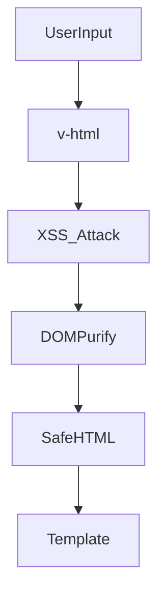

# Security: safe templates, v-html

## Фундаментальні механізми безпеки у Vue3

Безпека у фронтенд-додатках — це багаторівнева система, яка включає захист шаблонів, даних, API, а також інтеграцію з серверними механізмами. У Vue3 основна увага приділяється безпечному рендерингу даних, захисту від XSS, CSRF, Clickjacking, ін’єкцій та контролю доступу.

### Чому це важливо?

-   Користувачі взаємодіють із динамічними даними, які можуть містити шкідливий код.
-   Веб-додатки часто мають доступ до приватної інформації, токенів, cookies.
-   Атаки на фронтенд — це перший крок до компрометації бекенду.

---

## XSS (Cross-Site Scripting) у Vue

**XSS** — це атака, коли зловмисник вставляє шкідливий JavaScript у додаток через user input, API або незахищені шаблони.

### Як виникає XSS у Vue?

-   Використання `v-html` для рендерингу даних без санітизації.
-   Вставка даних із API, які не проходять перевірку.
-   Відсутність ескейпінгу у шаблонах.

#### Приклад:

```vue
<template>
    <div v-html="userComment"></div>
</template>
```

Якщо `userComment` містить `<script>alert('XSS')</script>`, скрипт буде виконано.

### Захист:

-   **DOMPurify** — бібліотека для санітизації HTML.
-   **CSP** — політика, яка блокує виконання небезпечних скриптів.
-   **Ескейпінг** — автоматичний у Vue для звичайних інтерполяцій (`{{ }}`).

#### Приклад використання DOMPurify:

```js
import DOMPurify from "dompurify";
const safeHTML = DOMPurify.sanitize(userComment);
```

---

## CSRF (Cross-Site Request Forgery)

**CSRF** — атака, коли зловмисник змушує користувача виконати небажаний запит до API.

### Як захиститися?

-   Використовуйте CSRF-токени у формах та запитах.
-   Встановлюйте SameSite cookies.
-   Перевіряйте реферер/оригін запиту на сервері.

#### Приклад CSRF-токена у формі:

```html
<input type="hidden" name="csrf" :value="csrfToken" />
```

---

## Clickjacking

**Clickjacking** — атака, коли додаток вставляють у iframe, щоб змусити користувача натиснути на приховані елементи.

### Захист:

-   Встановіть заголовок `X-Frame-Options: DENY`.
-   Використовуйте CSP для блокування фреймів.

---

## Ін’єкції (SQL, NoSQL, Command)

**Ін’єкції** — атаки через незахищені API, коли дані користувача потрапляють у запити без перевірки.

### Захист:

-   Валідація та санітизація даних на сервері.
-   Використання ORM/ODM.

---

## Content Security Policy (CSP)

**CSP** — це політика, яка обмежує джерела скриптів, стилів, зображень.

### Як працює CSP?

-   Додається у `<meta>` або HTTP-заголовок.
-   Блокує inline-скрипти, eval, зовнішні ресурси.

#### Приклад:

```html
<meta
    http-equiv="Content-Security-Policy"
    content="default-src 'self'; script-src 'self'"
/>
```

---

## Advanced: WebSockets, OAuth, SSO, Audit Tools

-   **WebSockets**: автентифікація, перевірка origin, шифрування.
-   **OAuth/SSO**: використовуйте перевірені бібліотеки, не зберігайте токени у localStorage.
-   **Audit**: інтегруйте Snyk, OWASP ZAP для автоматичного тестування.

---

## Best Practices

-   Не використовуйте `v-html` для неперевірених даних.
-   Всі дані з API — через санітизацію.
-   Використовуйте HTTPS для всіх запитів.
-   Зберігайте токени у httpOnly cookies.
-   Валідуйте дані на клієнті та сервері.
-   Встановлюйте CSP, helmet, X-Frame-Options.
-   Регулярно оновлюйте залежності.
-   Інтегруйте автоматичне тестування безпеки у CI/CD.

---

## Таблиця порівняння методів захисту

| Метод      | Захист від        | Плюси      | Мінуси                        |
| ---------- | ----------------- | ---------- | ----------------------------- |
| CSP        | XSS, Clickjacking | Гнучкість  | Може блокувати легітимний код |
| DOMPurify  | XSS               | Простота   | Не захищає API                |
| CSRF-токен | CSRF              | Надійність | Потрібна інтеграція           |
| HTTPS      | MITM, витік       | Стандарт   | Потрібен сертифікат           |

---

## Діаграма: flow атаки XSS і захисту



---

## Практичні кейси

-   Тестування безпеки через OWASP ZAP:
    -   Запустіть сканування, перевірте XSS, CSRF
-   Інтеграція Snyk у CI/CD для audit залежностей
-   Використання helmet для налаштування HTTP-заголовків

---

## FAQ по security у Vue

-   Чи можна використовувати v-html? — Тільки для довірених, санітизованих даних
-   Як захистити API? — Валідація, HTTPS, CORS, токени
-   Як тестувати XSS? — Використовуйте OWASP ZAP, ручне введення скриптів
-   Де зберігати токени? — httpOnly cookies, не localStorage

---

## Додаткові ресурси

-   [OWASP Top 10](https://owasp.org/www-project-top-ten/)
-   [DOMPurify](https://github.com/cure53/DOMPurify)
-   [Vue Security Guide](https://vuejs.org/guide/best-practices/security.html)
-   [Snyk](https://snyk.io/)
-   [OWASP ZAP](https://www.zaproxy.org/)

---

## Підсумок

Безпека у Vue3 — це не лише про шаблони, а про комплексний підхід: санітизація, політики, аудит, best practices. Використовуйте сучасні інструменти, тестуйте додаток, оновлюйте залежності та не ігноруйте навіть дрібні ризики.
