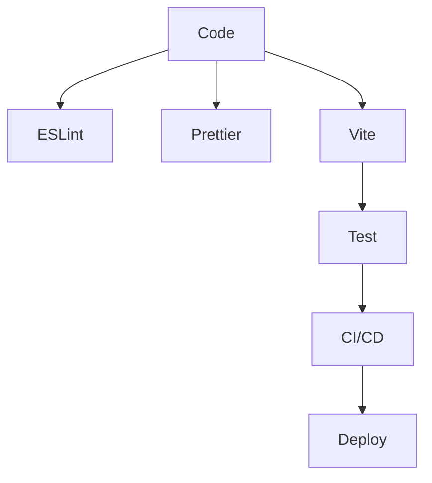

# Tooling: Vite, ESLint, Prettier, Testing

## Фундаментальні механізми tooling у Vue3

Tooling — це набір інструментів, які автоматизують розробку, забезпечують якість коду, прискорюють збірку та тестування. У сучасному Vue3-проєкті використовують Vite для збірки, ESLint для лінтингу, Prettier для форматування, Jest/Vitest/Cypress для тестування.

---

## Vite: сучасний збірник для Vue

Vite — це швидкий збірник, який використовує ES-модулі, hot module replacement (HMR), оптимізує продуктивність.

### Основні можливості:

-   Миттєвий старт dev-сервера.
-   HMR для швидкої розробки.
-   Плагіни для розширення функціоналу.
-   Оптимізація продакшн-білду.

#### Приклад конфігурації:

```js
// vite.config.js
import { defineConfig } from "vite";
import vue from "@vitejs/plugin-vue";

export default defineConfig({
    plugins: [vue()],
    server: {
        port: 3000,
        open: true,
    },
});
```

---

## ESLint: контроль якості коду

ESLint — це лінтер, який перевіряє код на помилки, стиль, best practices.

### Як працює ESLint?

-   Аналізує код за допомогою правил.
-   Підтримує плагіни для Vue, TypeScript.
-   Інтегрується у CI/CD.

#### Приклад конфігурації:

```js
// .eslintrc.js
module.exports = {
    extends: ["plugin:vue/vue3-recommended", "eslint:recommended", "prettier"],
    rules: {
        "vue/no-mutating-props": "error",
        "no-console": "warn",
    },
};
```

---

## Prettier: автоматичне форматування

Prettier — це форматер, який забезпечує єдиний стиль коду.

### Як працює Prettier?

-   Форматує код за заданими правилами.
-   Інтегрується з ESLint.
-   Працює у редакторі та CI/CD.

#### Приклад конфігурації:

```json
// .prettierrc
{
    "singleQuote": true,
    "semi": false,
    "printWidth": 100
}
```

---

## Testing: Jest, Vitest, Cypress

Тестування — це перевірка функціоналу, UI, інтеграцій.

### Види тестів:

-   Unit — тестування окремих функцій/компонентів.
-   Integration — тестування взаємодії компонентів.
-   E2E — тестування всього додатку (Cypress).

#### Приклад unit-тесту з Vitest:

```js
import { mount } from "@vue/test-utils";
import { describe, it, expect } from "vitest";
import MyButton from "./MyButton.vue";

describe("MyButton", () => {
    it("renders text", () => {
        const wrapper = mount(MyButton, { props: { label: "OK" } });
        expect(wrapper.text()).toContain("OK");
    });
});
```

---

## Advanced: автоматизація, CI/CD, code coverage

-   Інтегруйте ESLint, Prettier, тести у pre-commit хуки (lint-staged, husky).
-   Використовуйте GitHub Actions/GitLab CI для автоматичного запуску тестів.
-   Вимірюйте code coverage (coverage report).
-   Використовуйте snapshot-тести для UI.

---

## Best Practices

-   Всі зміни проходять через лінтер і форматер.
-   Тести — обов’язкові для критичних компонентів.
-   Використовуйте плагіни для Vite (svg, env, legacy).
-   Оновлюйте залежності регулярно.
-   Інтегруйте автоматичне тестування у CI/CD.
-   Використовуйте code coverage для контролю якості.
-   Документуйте конфігурації tooling.

---

## Таблиця: порівняння інструментів

| Інструмент  | Призначення        | Плюси                | Мінуси                      |
| ----------- | ------------------ | -------------------- | --------------------------- |
| Vite        | Збірка, dev-сервер | Швидкість, HMR       | Нові API                    |
| ESLint      | Лінтинг            | Гнучкість, плагіни   | Потрібна конфігурація       |
| Prettier    | Форматування       | Простота             | Може конфліктувати з ESLint |
| Vitest/Jest | Unit/Integration   | Швидкість, ізоляція  | Потрібна настройка          |
| Cypress     | E2E                | UI-тести, інтеграція | Важкі тести                 |

---

## Діаграма: flow tooling у Vue3-проєкті



---

## Практичні кейси

-   Налаштування pre-commit хуків для lint/format/test.
-   Інтеграція code coverage у CI/CD pipeline.
-   Використання Vite-плагінів для оптимізації білду.
-   Паралельний запуск тестів для швидкої перевірки.

---

## FAQ по tooling у Vue

-   Як інтегрувати ESLint і Prettier? — Через плагіни, конфігурації, pre-commit хуки.
-   Який тестовий фреймворк обрати? — Vitest для unit, Cypress для E2E.
-   Як виміряти code coverage? — Використовуйте coverage report у Vitest/Jest.
-   Як оптимізувати білд? — Використовуйте Vite-плагіни, tree-shaking.

---

## Додаткові ресурси

-   [Vite Documentation](https://vitejs.dev/)
-   [ESLint](https://eslint.org/)
-   [Prettier](https://prettier.io/)
-   [Vitest](https://vitest.dev/)
-   [Cypress](https://www.cypress.io/)
-   [Vue Testing Handbook](https://testing.vuejs.org/)

---

## Підсумок

Tooling — це основа сучасної розробки у Vue3. Автоматизація, якість, тестування та швидкість — ключові переваги, які дають ці інструменти. Впроваджуйте best practices, інтегруйте tooling у всі етапи розробки.
