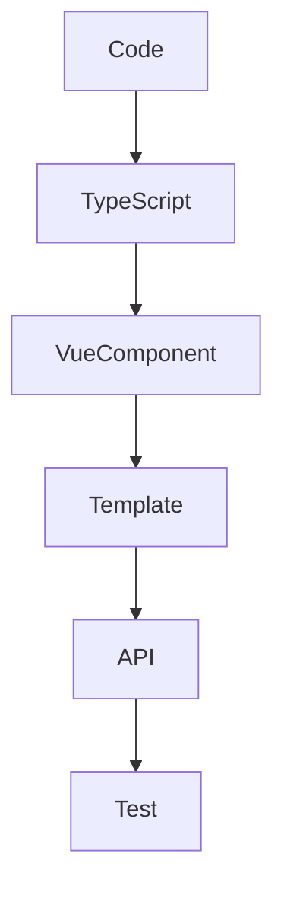

# Інтеграція з TypeScript

## Фундаментальні механізми інтеграції Vue3 з TypeScript

TypeScript — це надбудова над JavaScript, яка додає статичну типізацію, автодоповнення, рефакторинг і контроль помилок на етапі компіляції. Vue3 має повну підтримку TypeScript, що дозволяє типізувати компоненти, props, emits, ref, computed, API та інтегрувати типи у весь проєкт.

---

## Чому варто використовувати TypeScript у Vue3?

-   Зменшення кількості runtime-помилок.
-   Краще автодоповнення у редакторі.
-   Легший рефакторинг великих проєктів.
-   Документування API через типи.

---

## Основи типізації компонентів

### Типізація props

```ts
import { defineComponent } from "vue";

export default defineComponent({
    props: {
        count: {
            type: Number,
            required: true,
        },
    },
});
```

Але краще використовувати з типами:

```ts
import { defineComponent, PropType } from "vue";

export default defineComponent({
    props: {
        items: Array as PropType<string[]>,
    },
});
```

### Типізація emits

```ts
defineEmits<{ (e: "update", value: number): void }>();
```

---

## Composition API з TypeScript

Composition API дозволяє типізувати ref, computed, inject, provide.

#### Приклад:

```ts
import { ref, computed } from "vue";

const count = ref<number>(0);
const double = computed(() => count.value * 2);
```

---

## Типізація шаблонів

Шаблони у Vue3 автоматично отримують типи з компонентів, але для складних кейсів можна використовувати generic-компоненти.

#### Приклад generic-компонента:

```ts
<script lang="ts">
import { defineComponent, PropType } from 'vue';

export default defineComponent({
  props: {
    value: {
      type: Object as PropType<T>,
      required: true,
    },
  },
});
</script>
```

---

## Advanced: типізація слота, provide/inject, API

-   Типізуйте слоти через `SlotProps`.
-   Використовуйте типи для provide/inject:

```ts
provide("user", ref<User>({ name: "Anna" }));
inject<User>("user");
```

-   Типізуйте API-запити через інтерфейси.

---

## Best Practices

-   Використовуйте strict режим у tsconfig.json.
-   Типізуйте всі props, emits, слоти.
-   Використовуйте інтерфейси для складних об’єктів.
-   Не ігноруйте any — завжди уточнюйте типи.
-   Інтегруйте типи у API, state, router.
-   Оновлюйте типи при рефакторингу.

---

## Таблиця: порівняння підходів типізації

| Підхід             | Плюси           | Мінуси                 |
| ------------------ | --------------- | ---------------------- |
| Options API        | Простота        | Менше типів            |
| Composition API    | Гнучкість, типи | Складніше для новачків |
| Generic-компоненти | Гнучкість       | Складна типізація      |

---

## Діаграма: flow інтеграції TypeScript у Vue3



---

## Практичні кейси

-   Міграція проєкту з JS на TS: поступово додавайте типи, використовуйте strict режим.
-   Типізація API: створіть інтерфейси для response/request.
-   Типізація router: використовуйте типи для route params.
-   Типізація store (Pinia): визначайте state, getters, actions через інтерфейси.

---

## FAQ по інтеграції TypeScript у Vue

-   Як налаштувати tsconfig.json? — Використовуйте strict, include src, exclude node_modules.
-   Чи можна типізувати слоти? — Так, через SlotProps.
-   Як типізувати emits? — Через generic у defineEmits.
-   Як інтегрувати типи у API? — Через інтерфейси для response/request.

---

## Додаткові ресурси

-   [Vue + TypeScript Guide](https://vuejs.org/guide/typescript/overview.html)
-   [TypeScript Handbook](https://www.typescriptlang.org/docs/)
-   [Pinia + TypeScript](https://pinia.vuejs.org/cookbook/typescript.html)
-   [Vue Router + TS](https://router.vuejs.org/guide/advanced/typescript.html)

---

## Підсумок

Інтеграція TypeScript у Vue3 — це шлях до якісного, безпечного та масштабованого коду. Типізуйте все, використовуйте best practices, і ваш проєкт буде легким для підтримки та розвитку.
