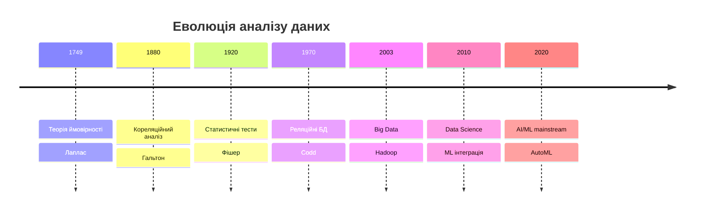
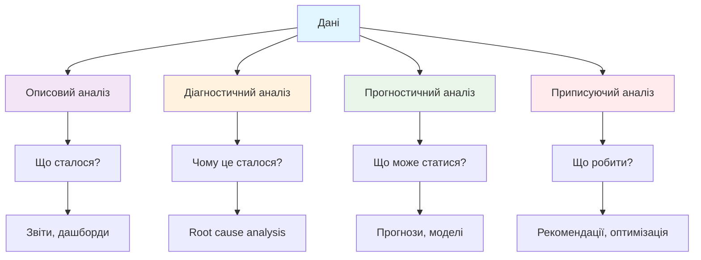

# Введення в аналіз даних

## Зміст розділу

-   [Що таке аналіз даних](#що-таке-аналіз-даних)
-   [Історія розвитку дисципліни](#історія-розвитку-дисципліни)
-   [Типи даних та їх класифікація](#типи-даних-та-їх-класифікація)
-   [Основні методи аналізу](#основні-методи-аналізу)
-   [Інструменти дата-аналітика](#інструменти-дата-аналітика)
-   [Практичні завдання](#практичні-завдання)

---

## Що таке аналіз даних

**Аналіз даних (Data Analysis)** — це процес систематичного дослідження, очищення, трансформації та моделювання даних з метою виявлення корисної інформації, формування висновків та підтримки прийняття рішень.

### Визначення та цілі

Аналіз даних включає в себе:

-   **Збір даних** з різних джерел
-   **Очищення та підготовку** даних до аналізу
-   **Дослідження** даних для виявлення патернів
-   **Статистичний аналіз** для перевірки гіпотез
-   **Візуалізацію** результатів
-   **Інтерпретацію** та формування рекомендацій

### Різниця між Data Analysis та Data Science

| Аспект          | Data Analysis                  | Data Science                          |
| --------------- | ------------------------------ | ------------------------------------- |
| **Фокус**       | Аналіз існуючих даних          | Створення нових методів та алгоритмів |
| **Методи**      | Статистика, візуалізація       | ML, AI, статистика, програмування     |
| **Цілі**        | Відповіді на конкретні питання | Прогнозування та автоматизація        |
| **Інструменти** | Excel, SQL, Tableau, Python/R  | Python, R, TensorFlow, Spark          |
| **Результат**   | Звіти, дашборди, insights      | Моделі, алгоритми, продукти           |

### Приклади з реального життя

**E-commerce:**

-   Аналіз поведінки клієнтів на сайті
-   Виявлення найпопулярніших товарів
-   Оптимізація цін та знижок

**Фінанси:**

-   Аналіз ризиків кредитування
-   Виявлення шахрайських операцій
-   Прогнозування курсів валют

**Маркетинг:**

-   Сегментація аудиторії
-   Оцінка ефективності рекламних кампаній
-   A/B тестування веб-сторінок

**Охорона здоров'я:**

-   Аналіз ефективності лікування
-   Епідеміологічні дослідження
-   Оптимізація роботи лікарень

## Історія розвитку дисципліни

### Витоки: від статистики до сучасності

**XVIII-XIX століття: Статистичні основи**

-   1749: П'єр-Симон Лаплас розробляє основи теорії ймовірності
-   1801: Карл Гаус вводить метод найменших квадратів
-   1880-ті: Френсіс Гальтон розробляє кореляційний аналіз

**XX століття: Розвиток методів**

-   1900-1930: Карл Пірсон та Рональд Фішер закладають основи сучасної статистики
-   1940-ві: Розвиток статистичного контролю якості (У. Шухарт)
-   1960-ті: Перші комп'ютерні системи для аналізу даних
-   1970: Edgar Codd розробляє реляційну модель баз даних

**Ера Big Data (2000-ні)**

-   2003: Створення Hadoop в Yahoo!
-   2006: Amazon запускає AWS
-   2008: Термін "Data Scientist" набуває популярності
-   2010: Apache Spark revolutionizes big data processing

**Сучасний етап (2010-2025)**

-   Хмарні обчислення стають стандартом
-   Машинне навчання інтегрується в бізнес-процеси
-   Автоматизація аналітичних процесів
-   Етичні питання використання даних

### Ключові віхи розвитку



### Вплив технологій на еволюцію

**Обчислювальна потужність:**

-   Від механічних калькуляторів до квантових комп'ютерів
-   Закон Мура та його вплив на аналітичні можливості

**Зберігання даних:**

-   Від паперових записів до хмарних сховищ
-   Зниження вартості зберігання в мільйони разів

**Програмне забезпечення:**

-   SPSS (1968) → R (1993) → Python (1990-ті) → Specialized tools
-   Open source революція в аналітиці

## Типи даних та їх класифікація

### За структурою

**Структуровані дані**

-   Організовані в таблиці з рядками та стовпцями
-   Легко піддаються аналізу стандартними інструментами
-   _Приклади:_ Бази даних, CSV файли, Excel таблиці

**Напівструктуровані дані**

-   Мають певну організацію, але не відповідають жорсткій схемі
-   Містять теги або маркери для розділення елементів
-   _Приклади:_ JSON, XML, веб-логи

**Неструктуровані дані**

-   Не мають заздалегідь визначеної структури
-   Потребують спеціальних методів обробки
-   _Приклади:_ Тексти, зображення, відео, аудіо

### За типом вимірювання

**Номінальні дані**

-   Категоріальні дані без природного порядку
-   Можна тільки рахувати та групувати
-   _Приклади:_ Стать, колір, країна, тип продукту

**Порядкові дані**

-   Категоріальні дані з природним порядком
-   Можна сортувати, але різниці між категоріями не мають точного значення
-   _Приклади:_ Оцінки (1-5 зірок), освітній рівень, розміри одягу

**Інтервальні дані**

-   Числові дані з рівними інтервалами між значеннями
-   Відсутня природна нульова точка
-   _Приклади:_ Температура за Цельсієм, роки, IQ

**Пропорційні дані**

-   Числові дані з природною нульовою точкою
-   Можна виконувати всі математичні операції
-   _Приклади:_ Вага, зріст, дохід, час

### За походженням

**Первинні дані**

-   Збираються безпосередньо для конкретного дослідження
-   Високий контроль якості, але дорогі в отриманні
-   _Методи збору:_ Опитування, експерименти, сенсори

**Вторинні дані**

-   Зібрані раніше для інших цілей
-   Дешевші та швидше доступні, але можуть бути неточними
-   _Джерела:_ Публічні бази даних, дослідження третіх сторін

```python
# Приклад визначення типів даних у Python
import pandas as pd
import numpy as np

# Створення DataFrame з різними типами даних
data = {
    'name': ['Анна', 'Петро', 'Марія'],           # Номінальні
    'education': ['Бакалавр', 'Магістр', 'PhD'],  # Порядкові
    'age': [25, 30, 35],                          # Пропорційні
    'salary': [50000, 75000, 100000],             # Пропорційні
    'satisfaction': [4, 5, 3]                     # Порядкові
}

df = pd.DataFrame(data)

# Перевірка типів даних
print("Типи даних:")
print(df.dtypes)

# Перетворення типів
df['education'] = df['education'].astype('category')
df['satisfaction'] = df['satisfaction'].astype('category')

print("\nОписова статистика:")
print(df.describe(include='all'))
```

### Якість даних

**Критерії якості:**

-   **Точність (Accuracy)** — наскільки дані відповідають реальності
-   **Повнота (Completeness)** — відсутність пропущених значень
-   **Консистентність (Consistency)** — узгодженість даних
-   **Актуальність (Timeliness)** — свіжість даних
-   **Валідність (Validity)** — відповідність встановленим правилам

## Основні методи аналізу

### Описовий аналіз (Descriptive Analytics)

**Мета:** Відповісти на питання "Що сталося?"

**Характеристики:**

-   Аналізує історичні дані
-   Використовує статистичні показники
-   Створює звіти та дашборди
-   Найпростіший та найпоширеніший тип аналізу

**Методи:**

-   Описова статистика (середнє, медіана, стандартне відхилення)
-   Візуалізація даних (графіки, діаграми)
-   Зведені таблиці та звіти

**Приклади застосування:**

-   Щомісячні звіти продажів
-   Аналіз трафіку веб-сайту
-   Фінансова звітність компанії

### Діагностичний аналіз (Diagnostic Analytics)

**Мета:** Відповісти на питання "Чому це сталося?"

**Характеристики:**

-   Досліджує причини подій
-   Шукає кореляції та залежності
-   Використовує статистичні тести

**Методи:**

-   Кореляційний аналіз
-   Регресійний аналіз
-   Дисперсійний аналіз (ANOVA)
-   Дерева рішень

**Приклади застосування:**

-   Аналіз причин зниження продажів
-   Дослідження факторів відтоку клієнтів
-   Визначення впливу маркетингових кампаній

### Прогностичний аналіз (Predictive Analytics)

**Мета:** Відповісти на питання "Що може статися?"

**Характеристики:**

-   Використовує історичні дані для прогнозування
-   Застосовує методи машинного навчання
-   Оцінює ймовірність майбутніх подій

**Методи:**

-   Лінійна та логістична регресія
-   Часові ряди
-   Машинне навчання (Random Forest, SVM)
-   Нейронні мережі

**Приклади застосування:**

-   Прогноз попиту на товари
-   Оцінка кредитних ризиків
-   Прогнозування відмов обладнання

### Приписуючий аналіз (Prescriptive Analytics)

**Мета:** Відповісти на питання "Що треба робити?"

**Характеристики:**

-   Найскладніший тип аналізу
-   Рекомендує конкретні дії
-   Оптимізує бізнес-процеси

**Методи:**

-   Оптимізаційні алгоритми
-   Симуляційне моделювання
-   Теорія ігор
-   Штучний інтелект

**Приклади застосування:**

-   Динамічне ціноутворення
-   Маршрутизація доставки
-   Управління запасами



### Комбінування методів

На практиці аналітики часто використовують комбінацію різних методів:

1. **Починають з описового аналізу** для розуміння даних
2. **Переходять до діагностичного** для виявлення причин
3. **Застосовують прогностичний** для планування
4. **Використовують приписуючий** для оптимізації рішень

## Інструменти дата-аналітика

### Мови програмування

**Python**

-   **Переваги:** Простий синтаксис, величезна екосистема бібліотек
-   **Основні бібліотеки:** pandas, NumPy, matplotlib, scikit-learn
-   **Ідеально для:** Загального аналізу, машинного навчання, автоматизації

**R**

-   **Переваги:** Спеціально створений для статистики, багато пакетів
-   **Основні пакети:** dplyr, ggplot2, tidyr, caret
-   **Ідеально для:** Статистичного аналізу, академічних досліджень

**SQL**

-   **Переваги:** Стандарт для роботи з базами даних
-   **Варіанти:** PostgreSQL, MySQL, SQL Server, BigQuery
-   **Ідеально для:** Витягування та трансформації даних

### Інструменти візуалізації

**Tableau**

-   Потужний інструмент для створення інтерактивних дашбордів
-   Drag-and-drop інтерфейс
-   Відмінна інтеграція з різними джерелами даних

**Power BI**

-   Microsoft рішення для бізнес-аналітики
-   Інтеграція з екосистемою Microsoft
-   Доступна ціна для малих команд

**Matplotlib/Seaborn (Python)**

-   Програмні бібліотеки для створення статичних графіків
-   Повний контроль над виглядом візуалізацій
-   Інтеграція з аналітичним кодом

**Plotly**

-   Створення інтерактивних візуалізацій
-   Підтримка Python, R, JavaScript
-   Можливість публікації в веб

### Таблиці та аналітичні інструменти

**Excel**

-   Універсальний інструмент для базового аналізу
-   Зрозумілий для бізнес-користувачів
-   Обмеження по розміру даних та складності аналізу

**Google Sheets**

-   Хмарна альтернатива Excel
-   Співпраця в реальному часі
-   Інтеграція з Google Analytics та іншими сервісами

**Jupyter Notebook**

-   Інтерактивне середовище для аналізу
-   Поєднання коду, візуалізації та документації
-   Стандарт для exploratory data analysis

### Критерії вибору інструментів

**Фактори для розгляду:**

1. **Розмір даних**

    - Малі дані (<1M записів): Excel, Google Sheets
    - Середні дані (1M-100M): Python/R, SQL
    - Великі дані (>100M): Spark, BigQuery, Hadoop

2. **Складність аналізу**

    - Базовий: Excel, Tableau
    - Середній: Python/R з готовими алгоритмами
    - Складний: Custom ML моделі, deep learning

3. **Команда та навички**

    - Нетехнічні користувачі: Tableau, Power BI
    - Аналітики: Python/R + SQL
    - Data scientists: Python/R + ML frameworks

4. **Бюджет**

    - Безкоштовно: Python, R, PostgreSQL
    - Помірно: Power BI, Google Cloud
    - Дорого: Tableau, Enterprise рішення

5. **Інтеграція**
    - Існуюча інфраструктура
    - API та можливості автоматизації
    - Безпека та комплаєнс

### Сучасні тренди

**Low-code/No-code платформи:**

-   Democratization аналітики
-   Швидкий прототипинг
-   Зниження бар'єрів входу

**Хмарні рішення:**

-   Масштабованість
-   Зниження IT overhead
-   Глобальна доступність

**AutoML:**

-   Автоматизація створення моделей
-   Зниження потреби в експертизі ML
-   Швидше time-to-value

## Практичні завдання

### Завдання 1: Класифікація даних

**Розгляньте наступні приклади даних та визначте їх тип:**

1. Температура повітря у Києві за останній місяць
2. Рейтинги фільмів на IMDb (1-10)
3. Назви країн у датасеті про населення
4. Кількість продажів товарів за день
5. Розміри футболок (S, M, L, XL)
6. IP-адреси користувачів веб-сайту
7. Текст відгуків клієнтів про продукт
8. Зарплати співробітників компанії

**Відповіді:**

1. Інтервальні дані (числові з рівними інтервалами)
2. Порядкові дані (категоріальні з природним порядком)
3. Номінальні дані (категоріальні без порядку)
4. Пропорційні дані (числові з природною нульовою точкою)
5. Порядкові дані (розміри мають логічний порядок)
6. Номінальні дані (ідентифікатори без порядку)
7. Неструктуровані дані (текст)
8. Пропорційні дані (числові з природною нульовою точкою)

### Завдання 2: Вибір методу аналізу

**Для кожної ситуації оберіть найбільш підходящий тип аналізу:**

1. **Ситуація:** Менеджер хоче зрозуміти, чому продажі впали на 15% в останньому кварталі.
   **Тип аналізу:** Діагностичний (потрібно знайти причини)

2. **Ситуація:** Компанія хоче передбачити попит на товари на наступні 3 місяці.
   **Тип аналізу:** Прогностичний (потрібно прогнозування)

3. **Ситуація:** Маркетинговій команді потрібен звіт про ефективність кампаній за рік.
   **Тип аналізу:** Описовий (потрібно підсумувати що сталося)

4. **Ситуація:** Логістична компанія хоче оптимізувати маршрути доставки.
   **Тип аналізу:** Приписуючий (потрібні рекомендації для дій)

### Завдання 3: Оцінка якості даних

**Проаналізуйте наступний датасет та визначте проблеми якості:**

```
Customer_ID | Name    | Age | Income | City      | Purchase_Date
1          | John    | 25  | 50000  | New York  | 2024-01-15
2          | Jane    |     | 60000  | London    | 2024-01-16
3          | Bob     | 30  | 55000  | new york  | 2024-13-45
4          | Alice   | 22  | -5000  | Paris     | 2024-01-18
5          | John    | 25  | 50000  | New York  | 2024-01-15
```

**Виявлені проблеми:**

-   **Повнота:** Відсутнє значення віку для Jane (рядок 2)
-   **Консистентність:** "New York" vs "new york" (різний регістр)
-   **Валідність:** Неможлива дата "2024-13-45" (рядок 3)
-   **Точність:** Від'ємний дохід -5000 (рядок 4)
-   **Дублікати:** Рядки 1 і 5 ідентичні

### Завдання 4: Практичний кейс

**Кейс:** Інтернет-магазин хоче збільшити конверсію на своєму сайті.

**Завдання:** Розробіть план аналізу, включаючи:

1. Які дані потрібно зібрати?
2. Який тип аналізу застосувати на кожному етапі?
3. Які інструменти використовувати?

**Приклад рішення:**

**Етап 1: Розуміння поточної ситуації (Описовий аналіз)**

-   Дані: відвідування сайту, конверсія по сторінках, джерела трафіку
-   Інструменти: Google Analytics, SQL для витягування даних
-   Мета: зрозуміти поточну конверсію та основні метрики

**Етап 2: Пошук причин низької конверсії (Діагностичний аналіз)**

-   Дані: поведінка користувачів, час на сторінці, точки виходу
-   Інструменти: Python/R для аналізу, візуалізація в Tableau
-   Мета: знайти вузькі місця в воронці продажів

**Етап 3: Прогнозування впливу змін (Прогностичний аналіз)**

-   Дані: A/B тести, історичні дані змін
-   Інструменти: статистичні тести, ML моделі
-   Мета: передбачити ефект від запропонованих змін

**Етап 4: Оптимізація (Приписуючий аналіз)**

-   Дані: результати тестів, користувацькі сценарії
-   Інструменти: оптимізаційні алгоритми
-   Мета: рекомендувати конкретні зміни для максимізації конверсії

### Завдання 5: Саморефлексія

**Питання для самоперевірки:**

1. Чи можете ви пояснити різницю між Data Analysis та Data Science своїми словами?
2. Які типи даних ви зустрічаєте у своїй роботі/навчанні?
3. Який метод аналізу ви б використали для вирішення конкретної проблеми у вашій сфері?
4. Які інструменти вам найцікавіше було б вивчити першими і чому?

Ці завдання допоможуть закріпити основні концепції та підготувати вас до більш складних тем у наступних розділах.

---

**Навігація:**

-   ⬅️ [Зміст підручника](./Інструкції.md)
-   ➡️ [Роль дата-аналітика в сучасному світі](./02_роль_дата_аналітика.md)

_Останнє оновлення: 04.08.2025_
