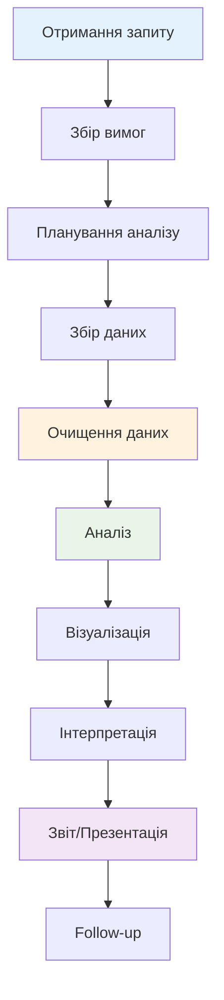

# Роль дата-аналітика в сучасному світі

## Зміст розділу

-   [Хто такий дата-аналітик](#хто-такий-дата-аналітик)
-   [Обов'язки та відповідальність](#обовязки-та-відповідальність)
-   [Навички та компетенції](#навички-та-компетенції)
-   [Кар'єрні шляхи](#карєрні-шляхи)
-   [Попит на ринку праці](#попит-на-ринку-праці)
-   [Виклики професії](#виклики-професії)

---

## Хто такий дата-аналітик

**Дата-аналітик (Data Analyst)** — це спеціаліст, який збирає, обробляє та інтерпретує дані для допомоги організаціям у прийнятті обґрунтованих бізнес-рішень.

### Визначення професії

Дата-аналітик є мостом між сирими даними та бізнес-інсайтами. Основна місія - перетворити числа та факти у зрозумілі висновки та рекомендації.

**Ключові характеристики професії:**

-   Фокус на аналізі існуючих даних
-   Створення звітів та візуалізацій
-   Підтримка бізнес-рішень фактами
-   Комунікація результатів аналізу

### Різниця між суміжними професіями

| Професія                          | Фокус                | Основні завдання                   | Типові інструменти            |
| --------------------------------- | -------------------- | ---------------------------------- | ----------------------------- |
| **Data Analyst**                  | Аналіз та звітність  | Звіти, дашборди, insights          | SQL, Excel, Tableau, Python/R |
| **Data Scientist**                | Моделювання та ML    | Прогностичні моделі, алгоритми     | Python/R, TensorFlow, Spark   |
| **Business Analyst**              | Бізнес-процеси       | Вимоги, процеси, системи           | Документація, UML, BPMN       |
| **Business Intelligence Analyst** | BI системи           | OLAP, сховища даних                | Power BI, QlikView, Cognos    |
| **Data Engineer**                 | Інфраструктура даних | ETL, пайплайни, архітектура        | Spark, Kafka, Airflow         |
| **Product Analyst**               | Продуктові метрики   | A/B тести, користувацька поведінка | Google Analytics, Mixpanel    |

### Рівні сеньйорності

**Junior Data Analyst (0-2 роки)**

-   Базові SQL запити
-   Створення простих звітів
-   Робота під наглядом
-   Використання готових шаблонів

**Middle Data Analyst (2-4 роки)**

-   Складні аналітичні задачі
-   Самостійна робота над проектами
-   Взаємодія зі стейкхолдерами
-   Наставництво джуніорів

**Senior Data Analyst (4+ роки)**

-   Стратегічні аналітичні ініціативи
-   Проектування аналітичних рішень
-   Лідерство команди
-   Консультації топ-менеджменту

**Lead Data Analyst / Analytics Manager (5+ років)**

-   Управління аналітичною командою
-   Визначення аналітичної стратегії
-   Бюджетування та планування
-   Cross-functional співпраця

### Місце в організаційній структурі

**Типові департаменти:**

-   IT/Technology
-   Finance/Controlling
-   Marketing
-   Operations
-   Strategy/Business Development
-   Окремий Analytics/Data Science департамент

**Взаємодія з іншими ролями:**

-   **Менеджмент:** Звітність та рекомендації
-   **IT:** Доступ до даних та інфраструктура
-   **Бізнес-користувачі:** Збір вимог та валідація результатів
-   **Data Engineers:** Якість даних та автоматизація
-   **UX/UI:** Дизайн дашбордів та користувацький досвід

## Обов'язки та відповідальність

### Щоденні задачі аналітика

**Збір та підготовка даних (30-40% часу)**

-   Витягування даних з різних джерел (БД, API, файли)
-   Очищення та валідація даних
-   Перевірка якості та консистентності
-   Створення та підтримка ETL процесів

**Аналіз даних (25-35% часу)**

-   Розвідувальний аналіз (EDA)
-   Статистичний аналіз
-   Виявлення трендів та патернів
-   Перевірка гіпотез

**Візуалізація та звітність (20-25% часу)**

-   Створення графіків та діаграм
-   Розробка дашбордів
-   Написання аналітичних звітів
-   Презентація результатів

**Комунікація та співпраця (10-15% часу)**

-   Збір вимог від бізнес-користувачів
-   Презентації для менеджменту
-   Консультації з колегами
-   Участь у проектних зустрічах

### Цикл типового проекту



### Ключові відповідальності

**Технічні відповідальності:**

-   Забезпечення точності аналітичних результатів
-   Дотримання best practices в роботі з даними
-   Документування методології та процесів
-   Підтримка якості коду та запитів

**Бізнес-відповідальності:**

-   Розуміння бізнес-контексту задач
-   Надання actionable insights
-   Своєчасна доставка результатів
-   Підтримка прийняття рішень фактами

**Комунікаційні відповідальності:**

-   Ясне пояснення технічних концепцій
-   Адаптація повідомлень під аудиторію
-   Проактивна комунікація проблем та ризиків
-   Навчання користувачів роботі з інструментами

### Метрики ефективності

**KPI для дата-аналітика:**

-   Час виконання запитів (Time to insight)
-   Точність прогнозів та аналізу
-   Кількість actionable insights
-   Рівень задоволеності внутрішніх клієнтів
-   Впровадження рекомендацій бізнесом
-   Кількість автоматизованих процесів

## Навички та компетенції

### Технічні навички (Hard Skills)

**Обов'язкові навички:**

**SQL (критично важливо)**

-   Базові запити (SELECT, WHERE, GROUP BY)
-   Joins та підзапити
-   Віконні функції
-   Оптимізація запитів
-   _Рівень:_ Впевнене володіння

**Excel/Google Sheets**

-   Pivot tables та формули
-   Умовне форматування
-   Макроси та VBA (базовий рівень)
-   Інтеграція з зовнішніми джерелами
-   _Рівень:_ Експертний

**Візуалізація даних**

-   Tableau або Power BI
-   Принципи дизайну дашбордів
-   Інтерактивні елементи
-   Сторітелінг з даними
-   _Рівень:_ Впевнене користування

**Статистика**

-   Описова статистика
-   Перевірка гіпотез
-   Кореляційний аналіз
-   Базові поняття ймовірності
-   _Рівень:_ Прикладне розуміння

**Бажані навички:**

**Python або R**

-   Pandas/dplyr для обробки даних
-   Matplotlib/ggplot2 для візуалізації
-   Jupyter Notebook / R Markdown
-   Базові алгоритми ML
-   _Рівень:_ Базовий-середній

**Бази даних**

-   Розуміння реляційних БД
-   NoSQL основи
-   ETL процеси
-   Data warehousing концепції
-   _Рівень:_ Концептуальне розуміння

### М'які навички (Soft Skills)

**Критично важливі:**

**Аналітичне мислення**

-   Здатність розкладати складні проблеми
-   Логічний підхід до вирішення задач
-   Увага до деталей
-   Критичне оцінення результатів

**Комунікація**

-   Ясне пояснення технічних концепцій
-   Презентаційні навички
-   Письмова комунікація (звіти, документація)
-   Активне слухання та збір вимог

**Бізнес-розуміння**

-   Знання бізнес-процесів компанії
-   Розуміння індустрії та ринку
-   Фінансова грамотність
-   Орієнтація на результат

## Кар'єрні шляхи

### Вертикальний розвиток

**Традиційна ієрархія:**

```
Junior Data Analyst (0-2 роки)
    ↓
Middle Data Analyst (2-4 роки)
    ↓
Senior Data Analyst (4-6 років)
    ↓
Lead Data Analyst (6-8 років)
    ↓
Analytics Manager (8+ років)
```

**Ключові віхи кар'єри:**

**Junior → Middle (2 роки)**

-   Самостійність у виконанні стандартних задач
-   Володіння основними інструментами
-   Розуміння бізнес-контексту

**Middle → Senior (2-3 роки)**

-   Ведення складних проектів
-   Наставництво джуніорів
-   Експертиза в домені

**Senior → Lead (2-4 роки)**

-   Стратегічне мислення
-   Управління командою
-   Cross-functional лідерство

### Горизонтальні переходи

**Спеціалізація по доменах:**

-   **Marketing Analyst** - аналіз кампаній, attribution, customer journey
-   **Product Analyst** - метрики продукту, A/B тести, user behavior
-   **Financial Analyst** - фінансове моделювання, ризики, прогнозування
-   **Operations Analyst** - процеси, supply chain, ефективність
-   **People Analyst** - HR метрики, engagement, performance

**Спеціалізація по інструментам:**

-   **BI Developer** - створення сховищ даних, ETL
-   **Visualization Specialist** - дизайн дашбордів, UX
-   **Analytics Engineer** - data modeling, dbt, інфраструктура

### Переходи в суміжні ролі

**Data Science треки:**

-   **Data Scientist** (Machine Learning фокус)
-   **ML Engineer** (productionizing моделей)
-   **Research Scientist** (академічні дослідження)

**Business треки:**

-   **Business Analyst** (процеси та вимоги)
-   **Product Manager** (продуктова стратегія)
-   **Strategy Analyst** (корпоративна стратегія)

**Management треки:**

-   **Analytics Manager** (управління командою аналітиків)
-   **Head of Analytics** (відповідальність за аналітичний напрямок)
-   **Chief Data Officer** (стратегічне управління даними)

### Географічні особливості

**США:**

-   Високі зарплати ($60K-$150K+)
-   Розвинена індустрія
-   Конкуренція за таланти

**Європа:**

-   GDPR комплаєнс важливий
-   Work-life balance
-   Різноманітність ринків

**Україна:**

-   Зростаючий ринок
-   Аутсорсингові можливості
-   Порівняно низькі зарплати, але зростають

## Попит на ринку праці

### Глобальні тренди

**Зростання попиту:**

-   22% зростання вакансій Data Analyst (2020-2030, USA)
-   "Sexiest job of the 21st century" (Harvard Business Review, 2012)
-   Digitalization пандемії прискорила попит на аналітиків

**Статистика ринку:**

-   2.5 квінтиліонів байт даних створюється щодня
-   90% світових даних створено за останні 2 роки
-   Дефіцит аналітичних талантів у всіх індустріях

### Зарплатні очікування (2024)

**США (річна зарплата):**

-   Junior: $45,000 - $65,000
-   Middle: $65,000 - $85,000
-   Senior: $85,000 - $120,000
-   Lead/Manager: $120,000 - $180,000

**Європа (річна зарплата):**

-   Junior: €35,000 - €50,000
-   Middle: €50,000 - €70,000
-   Senior: €70,000 - €100,000
-   Lead/Manager: €100,000 - €150,000

**Україна (місячна зарплата):**

-   Junior: $800 - $1,500
-   Middle: $1,500 - $2,500
-   Senior: $2,500 - $4,000
-   Lead/Manager: $4,000 - $7,000

### Фактори впливу на зарплату

**Технічні навички (+10-30%):**

-   Python/R володіння
-   ML/AI компетенції
-   Cloud platforms (AWS, GCP, Azure)
-   Advanced SQL

**Індустрія (+20-50%):**

-   Фінанси та банки (найвищі зарплати)
-   Tech компанії
-   Консалтинг
-   E-commerce

**Географія:**

-   Сан-Франциско/Нью-Йорк (найвищі)
-   Європейські столиці
-   Offshore розробка

## Виклики професії

### Технічні виклики

**Якість даних**

-   80% часу йде на підготовку даних
-   Неповні, неточні, застарілі дані
-   Різні формати та системи джерел
-   Необхідність постійної валідації

**Масштабування**

-   Зростання об'ємів даних
-   Складність інфраструктури
-   Performance оптимізація
-   Real-time вимоги

**Технологічні зміни**

-   Швидкість появи нових інструментів
-   Необхідність постійного навчання
-   Legacy systems інтеграція
-   Вибір правильного tech stack

### Бізнес-виклики

**Очікування менеджменту**

-   "Дані повинні дати всі відповіді"
-   Нереалістичні терміни
-   Недооцінка складності аналізу
-   Pressure на "швидкі insights"

**Комунікаційні бар'єри**

-   Технічний vs бізнес-мова
-   Пояснення uncertainty та limitations
-   Управління очікуваннями
-   Культурний опір data-driven рішенням

### Особистісні виклики

**Професійне вигорання**

-   Монотонність деяких задач
-   Високий тиск та дедлайни
-   Відсутність визнання результатів
-   Ізольованість від бізнес-результатів

**Етичні дилеми**

-   Privacy та GDPR compliance
-   Bias у даних та алгоритмах
-   Використання insights для manipulation
-   Відповідальність за business decisions

### Як долати виклики

**Технічні:**

-   Автоматизація рутинних процесів
-   Інвестиції в data quality
-   Continuous learning
-   Community involvement

**Бізнес:**

-   Proactive communication
-   Stakeholder education
-   Setting realistic expectations
-   Showing business impact

**Особистісні:**

-   Work-life balance
-   Різноманітність проектів
-   Professional development
-   Ethical guidelines

---

**Навігація:**

-   ⬅️ [Введення в аналіз даних](./01_введення_в_аналіз_даних.md)
-   ➡️ [Життєвий цикл аналізу даних](./03_життєвий_цикл_аналізу_даних.md)

_Останнє оновлення: 04.08.2025_
