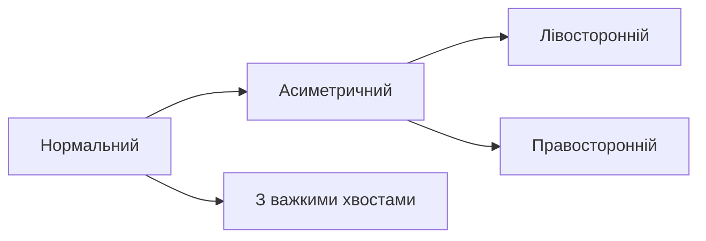

# Описова статистика

## Зміст розділу

-   [Основні поняття](#основні-поняття)
-   [Міри центральної тенденції](#міри-центральної-тенденції)
-   [Міри варіабельності](#міри-варіабельності)
-   [Міри форми розподілу](#міри-форми-розподілу)
-   [Квантилі та порядкові статистики](#квантилі-та-порядкові-статистики)
-   [Кореляція та коваріація](#кореляція-та-коваріація)
-   [Практичні приклади з Python](#практичні-приклади-з-python)

---

## Основні поняття

<!-- TODO: Визначення описової статистики -->
<!-- Різниця між описовою та інференційною статистикою -->
<!-- Роль у процесі аналізу даних -->

## Міри центральної тенденції

<!-- TODO: Детальний розбір середнього арифметичного -->
<!-- Медіана: коли використовувати -->
<!-- Мода: особливості застосування -->
<!-- Зважене середнє -->

### Середнє арифметичне

<!-- TODO: Формула, властивості, обмеження -->

### Медіана

<!-- TODO: Розрахунок для парної/непарної кількості спостережень -->
<!-- Стійкість до викидів -->

### Мода

<!-- TODO: Унімодальні, білмодальні, мультимодальні розподіли -->

```python
# TODO: Приклади розрахунку в Python
import numpy as np
import pandas as pd
import matplotlib.pyplot as plt

# Генерація тестових даних
# Розрахунок середнього, медіани, моди
# Порівняння результатів
```

## Міри варіабельності

<!-- TODO: Дисперсія та стандартне відхилення -->
<!-- Коефіцієнт варіації -->
<!-- Розмах та міжквартильний розмах -->
<!-- Середнє абсолютне відхилення -->

### Дисперсія

<!-- TODO: Популяційна vs вибіркова дисперсія -->
<!-- Математичні властивості -->

### Стандартне відхилення

<!-- TODO: Інтерпретація, одиниці вимірювання -->
<!-- Правило трьох сигм -->

```python
# TODO: Розрахунок різних мір варіабельності
# Порівняння на реальних даних
# Візуалізація розподілу
```

## Міри форми розподілу

<!-- TODO: Асиметрія (skewness) -->
<!-- Ексцес (kurtosis) -->
<!-- Інтерпретація та практичне значення -->

### Асиметрія

<!-- TODO: Лівостороння vs правостороння асиметрія -->
<!-- Методи розрахунку -->

### Ексцес

<!-- TODO: Платикуртичний, мезокуртичний, лептокуртичний -->



## Квантилі та порядкові статистики

<!-- TODO: Квартилі, дециль, перцентилі -->
<!-- Box plot та його інтерпретація -->
<!-- Виявлення викидів через IQR -->

```python
# TODO: Робота з квантилями в pandas
# Створення box plots
# Автоматичне виявлення викидів
```

## Кореляція та коваріація

<!-- TODO: Коваріація: визначення та обмеження -->
<!-- Кореляція Пірсона -->
<!-- Рангова кореляція Спірмена -->
<!-- Інтерпретація кореляційних коефіцієнтів -->

### Матриця кореляції

<!-- TODO: Побудова та інтерпретація -->
<!-- Візуалізація heatmap -->

```python
# TODO: Розрахунок кореляції різними методами
# Візуалізація кореляційної матриці
# Тестування значущості кореляції
```

## Практичні приклади з Python

<!-- TODO: Комплексний приклад аналізу датасету -->
<!-- Використання pandas.describe() -->
<!-- Створення звіту з описової статистики -->

```python
# TODO: Повний робочий приклад
# Завантаження реального датасету
# Повний описовий аналіз
# Інтерпретація результатів
```

---

**Навігація:**

-   ⬅️ [Життєвий цикл аналізу даних](./03_життєвий_цикл_аналізу_даних.md)
-   ➡️ [Теорія ймовірності](./05_теорія_ймовірності.md)

_Останнє оновлення: 04.08.2025_
