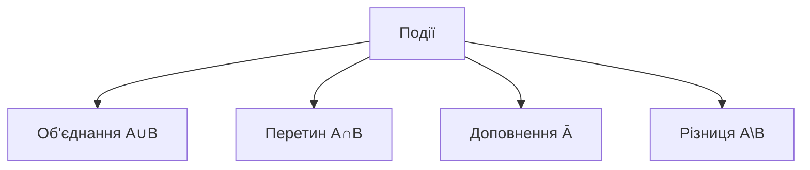
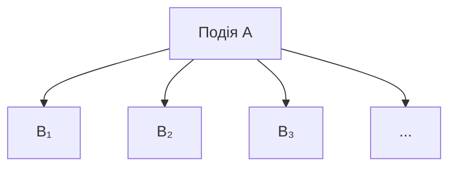

# Теорія ймовірності

## Зміст розділу

-   [Основні поняття теорії ймовірності](#основні-поняття-теорії-ймовірності)
-   [Класичне, частотне та суб'єктивне визначення](#класичне-частотне-та-субєктивне-визначення)
-   [Аксіоми та основні властивості](#аксіоми-та-основні-властивості)
-   [Умовна ймовірність](#умовна-ймовірність)
-   [Незалежність подій](#незалежність-подій)
-   [Формула повної ймовірності](#формула-повної-ймовірності)
-   [Теорема Байєса](#теорема-байєса)
-   [Комбінаторика в ймовірності](#комбінаторика-в-ймовірності)
-   [Практичні приклади](#практичні-приклади)

---

## Основні поняття теорії ймовірності

<!-- TODO: Випадковий експеримент, простір елементарних подій -->
<!-- Події та їх типи -->
<!-- Визначення ймовірності -->
<!-- Зв'язок з аналізом даних -->

### Простір подій

<!-- TODO: Детальне пояснення Ω, σ-алгебри -->
<!-- Приклади просторів подій -->

### Типи подій

<!-- TODO: Елементарні, складені, достовірні, неможливі -->
<!-- Операції над подіями -->



## Класичне, частотне та суб'єктивне визначення

<!-- TODO: Класичне визначення ймовірності -->
<!-- Частотний підхід -->
<!-- Суб'єктивна ймовірність -->
<!-- Порівняння підходів та їх застосування -->

### Класичне визначення

<!-- TODO: Формула P(A) = |A|/|Ω| -->
<!-- Умови застосування -->
<!-- Приклади з грою в кості -->

### Частотний підхід

<!-- TODO: Закон великих чисел -->
<!-- Статистична ймовірність -->

```python
# TODO: Симуляція закону великих чисел
import numpy as np
import matplotlib.pyplot as plt

# Симуляція кидання монети
# Демонстрація збіжності частоти до ймовірності
```

## Аксіоми та основні властивості

<!-- TODO: Аксіоми Колмогорова -->
<!-- Основні властивості ймовірності -->
<!-- Принцип включень-виключень -->

### Аксіоми Колмогорова

<!-- TODO: Детальний розбір трьох аксіом -->
<!-- Наслідки аксіом -->

### Властивості ймовірності

<!-- TODO: P(∅) = 0, P(Ā) = 1 - P(A), тощо -->

```python
# TODO: Демонстрація властивостей на прикладах
# Перевірка аксіом через симуляцію
```

## Умовна ймовірність

<!-- TODO: Визначення P(A|B) = P(A∩B)/P(B) -->
<!-- Інтерпретація та практичне значення -->
<!-- Приклади з медичної діагностики -->

### Формула умовної ймовірності

<!-- TODO: Математичне обґрунтування -->
<!-- Умови застосування -->

### Ланцюгове правило

<!-- TODO: P(A₁∩A₂∩...∩Aₙ) -->

```python
# TODO: Розрахунок умовної ймовірності
# Приклад з медичними тестами
# Візуалізація через таблиці спряженості
```

## Незалежність подій

<!-- TODO: Визначення незалежності -->
<!-- Різниця між незалежністю та відсутністю кореляції -->
<!-- Парна та взаємна незалежність -->

### Перевірка незалежності

<!-- TODO: P(A∩B) = P(A)P(B) -->
<!-- Тестування гіпотези незалежності -->

```python
# TODO: Тестування незалежності в Python
import scipy.stats as stats
# Chi-square тест незалежності
# Приклади з реальними даними
```

## Формула повної ймовірності

<!-- TODO: Розбиття простору на непересічні події -->
<!-- Формула та її застосування -->
<!-- Зв'язок з теоремою Байєса -->



## Теорема Байєса

<!-- TODO: Формула Байєса -->
<!-- Апріорна та апостеріорна ймовірність -->
<!-- Застосування в машинному навчанні -->
<!-- Наївний Байєсів класифікатор -->

### Інтерпретація теореми Байєса

<!-- TODO: Філософський аспект -->
<!-- Байєсівський vs частотний підхід -->

### Практичні застосування

<!-- TODO: Медична діагностика -->
<!-- Спам-фільтри -->
<!-- A/B тестування -->

```python
# TODO: Реалізація наївного Байєсівського класифікатора
from sklearn.naive_bayes import GaussianNB
# Приклад класифікації тексту
# Інтерпретація результатів через призму теореми Байєса
```

## Комбінаторика в ймовірності

<!-- TODO: Розміщення, перестановки, сполучення -->
<!-- Застосування в розрахунку ймовірностей -->
<!-- Принцип включень-виключень -->

### Основні формули

<!-- TODO: n!, C(n,k), A(n,k) -->
<!-- Біноміальні коефіцієнти -->

```python
# TODO: Комбінаторні розрахунки в Python
import math
from itertools import combinations, permutations
# Розрахунок ймовірностей у карткових іграх
# Лотерея та інші приклади
```

## Практичні приклади

<!-- TODO: Комплексні задачі -->
<!-- Інтеграція всіх вивчених концепцій -->
<!-- Реальні кейси з бізнесу -->

### Кейс: Аналіз A/B тесту

<!-- TODO: Застосування теорії ймовірності в A/B тестуванні -->

### Кейс: Оцінка ризиків

<!-- TODO: Фінансові ризики через призму ймовірності -->

```python
# TODO: Повний аналіз реального кейсу
# Від постановки задачі до інтерпретації результатів
```

---

**Навігація:**

-   ⬅️ [Описова статистика](./04_описова_статистика.md)
-   ➡️ [Розподіли ймовірностей](./06_розподіли_ймовірностей.md)

_Останнє оновлення: 04.08.2025_
