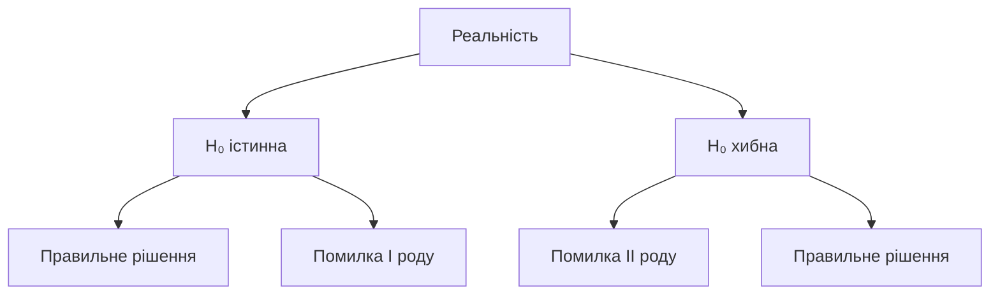

# Статистичні тести та перевірка гіпотез

## Зміст розділу

-   [Основи перевірки гіпотез](#основи-перевірки-гіпотез)
-   [Типи помилок](#типи-помилок)
-   [t-тести](#t-тести)
-   [Хі-квадрат тести](#хі-квадрат-тести)
-   [ANOVA](#anova)
-   [Непараметричні тести](#непараметричні-тести)
-   [Множинні порівняння](#множинні-порівняння)
-   [Практичні приклади](#практичні-приклади)

---

## Основи перевірки гіпотез

<!-- TODO: Нульова та альтернативна гіпотези -->
<!-- p-value та рівень значущості -->
<!-- Статистична потужність -->
<!-- Вибір розміру вибірки -->

## Типи помилок

<!-- TODO: Помилка I роду (α) -->
<!-- Помилка II роду (β) -->
<!-- Баланс між помилками -->



## t-тести

<!-- TODO: Одновибірковий t-тест -->
<!-- Двовибірковий t-тест -->
<!-- Парний t-тест -->
<!-- Умови застосування -->

```python
# TODO: Реалізація t-тестів
from scipy import stats
import pandas as pd

# Приклади для всіх типів t-тестів
# Перевірка умов застосування
```

## Хі-квадрат тести

<!-- TODO: Тест згоди -->
<!-- Тест незалежності -->
<!-- Тест однорідності -->

## ANOVA

<!-- TODO: Одно факторний ANOVA -->
<!-- Двофакторний ANOVA -->
<!-- Post-hoc аналіз -->

## Непараметричні тести

<!-- TODO: Тест Манна-Уітні -->
<!-- Тест Вілкоксона -->
<!-- Тест Крускала-Волліса -->
<!-- Коли використовувати -->

## Множинні порівняння

<!-- TODO: Проблема множинних порівнянь -->
<!-- Корекція Бонферроні -->
<!-- FDR корекція -->

## Практичні приклади

<!-- TODO: A/B тестування -->
<!-- Аналіз ефективності маркетингових кампаній -->
<!-- Медичні дослідження -->

---

**Навігація:**

-   ⬅️ [Розподіли ймовірностей](./06_розподіли_ймовірностей.md)
-   ➡️ [Основи Python для аналізу даних](./08_основи_python.md)

_Останнє оновлення: 04.08.2025_
