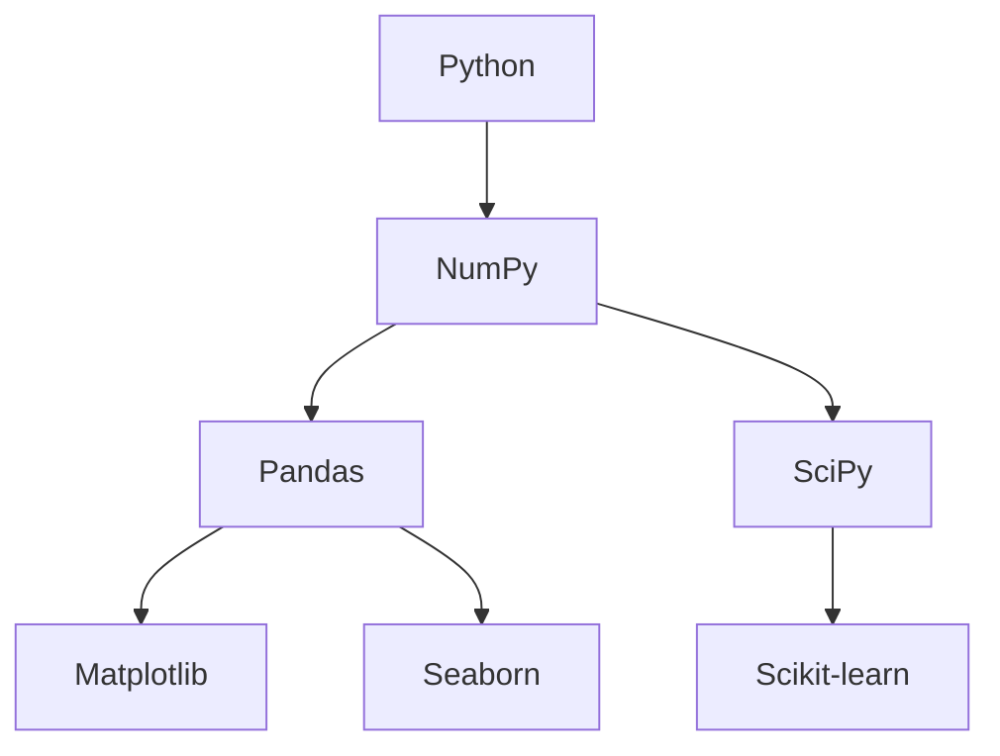

# Основи Python для аналізу даних

## Зміст розділу

-   [Налаштування середовища](#налаштування-середовища)
-   [Основи синтаксису Python](#основи-синтаксису-python)
-   [Структури даних](#структури-даних)
-   [Робота з файлами](#робота-з-файлами)
-   [Основи програмування](#основи-програмування)
-   [Бібліотеки для аналізу даних](#бібліотеки-для-аналізу-даних)
-   [Jupyter Notebook](#jupyter-notebook)
-   [Best practices](#best-practices)

---

## Налаштування середовища

<!-- TODO: Встановлення Python -->
<!-- Anaconda vs pip -->
<!-- Віртуальні середовища -->
<!-- IDE та редактори -->

### Встановлення Anaconda

<!-- TODO: Покрокова інструкція -->
<!-- Управління пакетами через conda -->

```bash
# TODO: Команди для встановлення основних пакетів
conda install pandas numpy matplotlib seaborn scipy scikit-learn
```

## Основи синтаксису Python

<!-- TODO: Змінні та типи даних -->
<!-- Оператори -->
<!-- Умовні конструкції -->
<!-- Цикли -->
<!-- Функції -->

```python
# TODO: Основні приклади синтаксису
# Змінні
# Умови
# Цикли
# Функції
```

## Структури даних

<!-- TODO: Списки (lists) -->
<!-- Кортежі (tuples) -->
<!-- Словники (dictionaries) -->
<!-- Множини (sets) -->
<!-- Списки comprehensions -->

```python
# TODO: Приклади роботи зі структурами даних
# List comprehensions
# Dictionary comprehensions
# Практичні приклади для аналізу даних
```

## Робота з файлами

<!-- TODO: Читання текстових файлів -->
<!-- CSV файли -->
<!-- JSON -->
<!-- Excel файли -->
<!-- Робота з шляхами -->

```python
# TODO: Приклади читання різних форматів
import pandas as pd
import json
import os

# Читання CSV
# Читання Excel
# Робота з JSON
```

## Основи програмування

<!-- TODO: Функції -->
<!-- Класи та об'єкти -->
<!-- Модулі та пакети -->
<!-- Обробка помилок -->
<!-- Декоратори -->

```python
# TODO: Приклади ООП для аналізу даних
class DataAnalyzer:
    def __init__(self, data):
        self.data = data

    def summary(self):
        # Метод для створення зведення
        pass
```

## Бібліотеки для аналізу даних

<!-- TODO: Огляд екосистеми -->
<!-- NumPy для числових обчислень -->
<!-- Pandas для роботи з даними -->
<!-- Matplotlib/Seaborn для візуалізації -->
<!-- SciPy для статистики -->

### Ієрархія бібліотек



## Jupyter Notebook

<!-- TODO: Що таке Jupyter -->
<!-- Встановлення та запуск -->
<!-- Робота з комірками -->
<!-- Магічні команди -->
<!-- Best practices -->

```python
# TODO: Корисні магічні команди
%matplotlib inline
%time
%timeit
%load_ext autoreload
%autoreload 2
```

## Best practices

<!-- TODO: PEP 8 стандарти -->
<!-- Структура проекту -->
<!-- Документування коду -->
<!-- Тестування -->
<!-- Версіонування -->

### Структура аналітичного проекту

```
project/
├── data/
│   ├── raw/
│   ├── processed/
│   └── external/
├── notebooks/
├── src/
├── tests/
├── requirements.txt
└── README.md
```

---

**Навігація:**

-   ⬅️ [Статистичні тести та перевірка гіпотез](./07_статистичні_тести.md)
-   ➡️ [Бібліотека NumPy](./09_numpy.md)

_Останнє оновлення: 04.08.2025_
