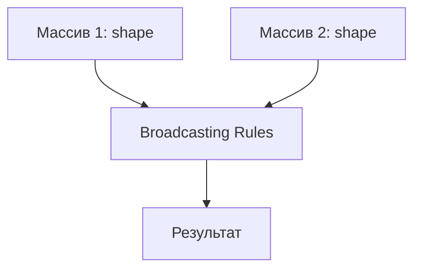

# Бібліотека NumPy

## Зміст розділу

-   [Вступ до NumPy](#вступ-до-numpy)
-   [Масиви NumPy](#масиви-numpy)
-   [Індексація та зрізи](#індексація-та-зрізи)
-   [Математичні операції](#математичні-операції)
-   [Універсальні функції](#універсальні-функції)
-   [Broadcasting](#broadcasting)
-   [Лінійна алгебра](#лінійна-алгебра)
-   [Генерація випадкових чисел](#генерація-випадкових-чисел)
-   [Оптимізація продуктивності](#оптимізація-продуктивності)

---

## Вступ до NumPy

<!-- TODO: Що таке NumPy та навіщо він потрібен -->
<!-- Переваги над стандартними списками Python -->
<!-- Встановлення та імпорт -->

```python
# TODO: Порівняння продуктивності NumPy vs Python lists
import numpy as np
import time

# Демонстрація швидкості
```

## Масиви NumPy

<!-- TODO: Створення масивів різними способами -->
<!-- ndarray vs list -->
<!-- Атрибути масивів: shape, dtype, ndim -->
<!-- Зміна форми масивів -->

```python
# TODO: Різні способи створення масивів
# np.array(), np.zeros(), np.ones(), np.arange(), np.linspace()
# Робота з dtype
# reshape, flatten, ravel
```

## Індексація та зрізи

<!-- TODO: Основна індексація -->
<!-- Розширена індексація -->
<!-- Boolean indexing -->
<!-- Fancy indexing -->

```python
# TODO: Приклади всіх типів індексації
# Одновимірні та багатовимірні масиви
# Умовна індексація
# Модифікація елементів
```

## Математичні операції

<!-- TODO: Елементарні операції -->
<!-- Операції між масивами -->
<!-- Агрегатні функції -->
<!-- Статистичні функції -->

```python
# TODO: Приклади математичних операцій
# sum, mean, std, var
# min, max, argmin, argmax
# Осьові операції
```

## Універсальні функції

<!-- TODO: Що таке ufunc -->
<!-- Тригонометричні функції -->
<!-- Логарифмічні та експоненціальні -->
<!-- Створення власних ufunc -->

```python
# TODO: Приклади ufunc
# np.sin, np.cos, np.exp, np.log
# Векторизація функцій
```

## Broadcasting

<!-- TODO: Правила broadcasting -->
<!-- Приклади broadcasting -->
<!-- Коли broadcasting не працює -->
<!-- Оптимізація за допомогою broadcasting -->



```python
# TODO: Детальні приклади broadcasting
# Операції з масивами різних розмірів
# Практичні застосування
```

## Лінійна алгебра

<!-- TODO: Множення матриць -->
<!-- Власні числа та вектори -->
<!-- Розкладання матриць -->
<!-- Розв'язання систем лінійних рівнянь -->

```python
# TODO: np.linalg модуль
# Dot product, matrix multiplication
# Eigenvalues, eigenvectors
# SVD, QR decomposition
```

## Генерація випадкових чисел

<!-- TODO: np.random модуль -->
<!-- Різні розподіли -->
<!-- Seed для відтворюваності -->
<!-- Вибірка з популяції -->

```python
# TODO: Генерація випадкових даних
# Нормальний, рівномірний розподіли
# Створення тестових датасетів
```

## Оптимізація продуктивності

<!-- TODO: Vectorization vs loops -->
<!-- Memory layout -->
<!-- NumPy vs NumExpr -->
<!-- Профілювання коду -->

```python
# TODO: Порівняння ефективності різних підходів
# Оптимізація циклів
# Використання numba
```

---

**Навігація:**

-   ⬅️ [Основи Python для аналізу даних](./08_основи_python.md)
-   ➡️ [Бібліотека Pandas](./10_pandas.md)

_Останнє оновлення: 04.08.2025_
