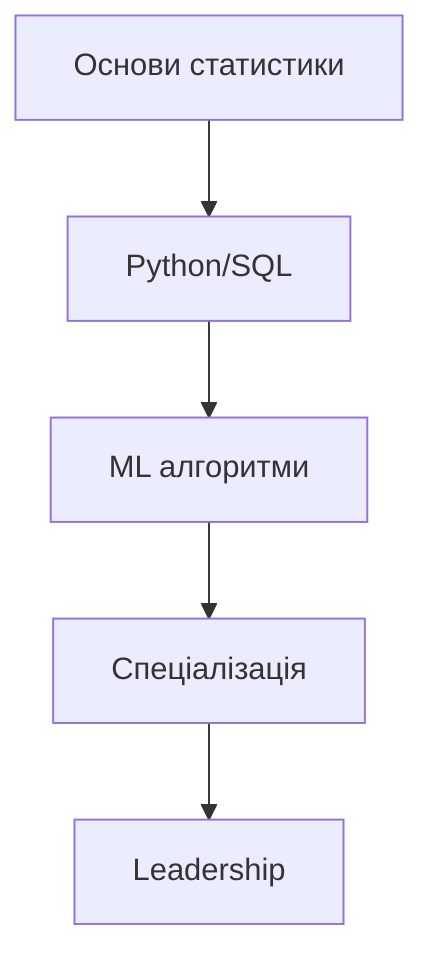

# Безперервне навчання та ресурси

## Зміст розділу

-   [Філософія lifelong learning](#філософія-lifelong-learning)
-   [Онлайн курси та платформи](#онлайн-курси-та-платформи)
-   [Книги з аналізу даних](#книги-з-аналізу-даних)
-   [Блоги та подкасти](#блоги-та-подкасти)
-   [Конференції та події](#конференції-та-події)
-   [Спільноти та форуми](#спільноти-та-форуми)
-   [Побудова learning плану](#побудова-learning-плану)
-   [Сертифікації](#сертифікації)

---

## Філософія lifelong learning

<!-- TODO: Важливість постійного навчання в IT -->
<!-- Швидкість змін у технологіях -->
<!-- Growth mindset -->

## Онлайн курси та платформи

<!-- TODO: Огляд основних платформ -->

-   **Coursera**: Data Science спеціалізації
-   **edX**: MIT, Harvard курси
-   **Udacity**: Nanodegree програми
-   **DataCamp**: Інтерактивне навчання
-   **Kaggle Learn**: Безкоштовні мікрокурси

## Книги з аналізу даних

<!-- TODO: Рекомендована література -->

### Статистика та математика

-   "The Elements of Statistical Learning" - Hastie, Tibshirani, Friedman
-   "Python for Data Analysis" - Wes McKinney
-   "Hands-On Machine Learning" - Aurélien Géron

### Бізнес-аналітика

-   "Storytelling with Data" - Cole Nussbaumer Knaflic
-   "The Signal and the Noise" - Nate Silver

## Блоги та подкасти

<!-- TODO: Корисні ресурси для читання -->

### Блоги

-   Towards Data Science (Medium)
-   KDnuggets
-   Analytics Vidhya
-   R-bloggers

### Подкасти

-   Data Skeptic
-   Linear Digressions
-   The Data Science Podcast

## Конференції та події

<!-- TODO: Основні події індустрії -->

-   **Міжнародні**: Strata Data Conference, PyData
-   **Локальні**: Data Science UA, Kyiv Data Science Club
-   **Онлайн**: NeurIPS, ICML workshops

## Спільноти та форуми

<!-- TODO: Де шукати допомогу та нетворкінг -->

-   **Stack Overflow**: Технічні питання
-   **Reddit**: r/MachineLearning, r/analytics
-   **LinkedIn**: Professional groups
-   **Discord/Slack**: Data science communities

## Побудова learning плану

<!-- TODO: Як структурувати навчання -->

### Етапи розвитку

1. **Foundations** (3-6 місяців)
2. **Specialization** (6-12 місяців)
3. **Advanced Topics** (ongoing)
4. **Leadership Skills** (1-2 роки досвіду)

### Learning roadmap

## Сертифікації

<!-- TODO: Корисні сертифікати -->

### Технічні сертифікації

-   **Google**: Professional Data Engineer
-   **AWS**: Certified Data Analytics
-   **Microsoft**: Azure Data Scientist Associate
-   **Databricks**: Certified Data Analyst

### Університетські програми

-   **Stanford**: Statistical Learning
-   **MIT**: Introduction to Computational Thinking

---

## Підсумок

Аналіз даних - це динамічна сфера, що постійно розвивається. Успіх залежить від:

1. **Технічних навичок**: Постійне оновлення знань інструментів
2. **Soft skills**: Комунікація, критичне мислення
3. **Бізнес-розуміння**: Зв'язок між даними та бізнес-цілями
4. **Спільнота**: Активна участь у професійних мережах

Пам'ятайте: навчання ніколи не закінчується. Кожен новий проект - це можливість для росту!

---

**Навігація:**

-   ⬅️ [Технічне інтерв'ю з аналізу даних](./43_технічне_інтервю.md)
-   ➡️ [Зміст підручника](./Інструкції.md)

_Останнє оновлення: 04.08.2025_
